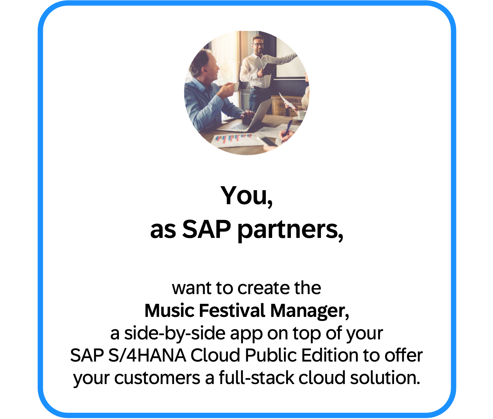
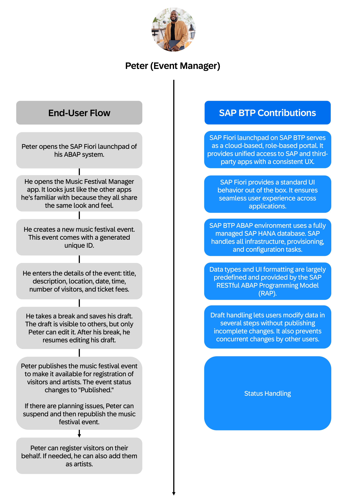
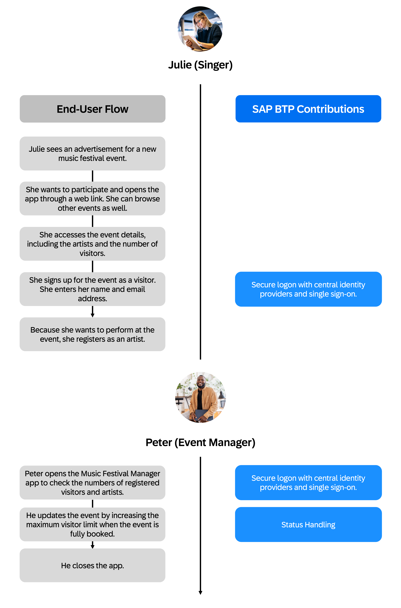

# Partner Reference Application *Music Festival Manager*

## Description

This Partner Reference Application repository provides you with a “golden path” for becoming a SaaS provider of multi-tenant applications. It is based on the SAP Business Technology Platform (SAP BTP) ABAP environment and extends SAP S/4HANA Cloud.

The guidance covers building, running, and integrating scalable applications using ABAP RESTful Application Programming Model (RAP). It features a design that let's you to deliver your application as a side-by-side extension for consumers using SAP S/4HANA Cloud. This ensures seamless integration and scalability. Such side-by-side extensions can also be integrated with other SAP solutions or non-SAP solutions.

By leveraging the SAP BTP ABAP environment and the ABAP RAP model, your application aligns with SAP’s standards for enterprise-grade business solutions. It offers a consistent, harmonized user experience and robust integration capabilities, including:

- A clean core architecture that ensures upgrade stability and independent lifecycle management.
- A scalable ABAP Cloud development model, empowered by ABAP RAP for efficient and extensible design.
- Secure, reliable, and future-proof integration with SAP S/4HANA Cloud.

The repository includes the **Music Festival Manager** application as a ready-to-run example. It also provides step-by-step tutorials to build, run, and deploy the application from scratch using an incremental development approach.

Based on this sample application, you will find the bill of materials and a sizing example. This addresses the question: "Which SAP BTP resources do I need to subscribe to and in what quantities?" It serves as a basis for cost calculation.

    

### About the Sample Application *Music Festival Manager*

Imagine you're an event manager, like Peter, whose job is to organize and host music festival events.

Your company uses SAP S/4HANA Cloud to run its business. You rely on its project management component to plan and staff events, collect costs, and purchase equipment. An SAP partner also provides a side-by-side application called **Music Festival Manager**. This application helps you publish music festival events and manage bookings for visitors and artists, such as Julie.

    

The sample showcases how a side-by-side application benefits from using SAP BTP ABAP environment. The image below shows the qualities relevant for enterprise-grade partner applications, supported by SAP BTP services and ABAP RAP model.

    

Upcoming versions of the sample application may include additional features provided by SAP BTP, as shown in the image below.

    

### Features and Values

Features of the Music Festival Manager include:

- Create, change, publish, and cancel music festival events
- Maintain, add, and remove visitors
- Cancel bookings
- Calculate the number of free seats and block overbooking

Key strategies and tools for developing the application are:

- Use Eclipse-based ABAP Development Tools (ADT) to develop and manage ABAP applications in the SAP ecosystem
- Use a state-of-the-art web application architecture combining HTML5 for UX, ABAP for business logic, and SAP HANA Cloud for high-performance data processing
- Make use of a model-driven development based on ABAP RAP, core data services (CDS), and SAP Fiori elements
- Offer a user experience that matches the SAP standard due to standard floor plan patterns, and out-of-the-box theming and personalization
- Use a draft concept to allow users to change data in multiple steps without having to publish incomplete changes
- Benefit from enterprise-grade security by authentication and role-based authorizations in line with SAP product standards and technology alignments
- Deploy the app as a multi-customer solution

## Requirements

The application is based on SAP BTP ABAP environment and SAP S/4HANA Cloud Public Edition. Therefore, here's what you need:

- **SAP BTP Account** – This is required to host and manage your application in a scalable, cloud-native environment.
- **Eclipse with ABAP Development Tools (ADT)** – This is used for back-end development and ABAP RAP modeling.
- **SAP Business Application Studio (BAS)** – This is a standardized IDE for developing Fiori applications efficiently.
- **GitHub Repository** – Use this repository to manage source code versioning, collaboration, and CI/CD pipelines.
- **SAP S/4HANA Cloud Public Edition** – This acts as the digital core, providing business processes and data integration.

For a detailed list of required entitlements, the proposed structure of subaccounts for the deployed Partner Reference Application, and the scaling effects of the multi-tenant solution: visit the [Bill of Materials](./Tutorials/60-BillOfMaterials.md).

## Overview

If you prefer a quick start with a deployment of the music festival manager application including all features without further explanation, follow the [quick start guide](./Tutorials/01-Quickstart.md).

## Tutorials

1. Develop the core application focusing on business models, business logic, and UI:
    1. [Prepare Your SAP BTP Account, SAP BAS and ADT for Development](./Tutorials/11-Prepare-BTP-Account-ADT-For-Dev.md)
    2. [Developing Business Objects: From Transaction Logic to UI and Service Exposure](./Tutorials/12-Develop-BTP-ABAP-RAP-Application.md)
    3. [Developing Business Logic for RAP Business Objects](./Tutorials/13-Develop-Business-Logic.md)
    4. [Building a Fiori-Based Web Application using ABAP RAP](./Tutorials/14-Develop-Web-Application.md)
    5. [Add authentication and role-based authorization](./Tutorials/21-AuthorizationObject-IAM-Roles.md)
    6. [Integrating your SAP Fiori application into the launchpad](./Tutorials/22-Integration%20Application%20into%20Launchpad.md)
2. Multitenancy and IAM
    1. [Learn about multitenancy, and how to build, deploy, and provision your application to consumers](./Tutorials/30-Multi-Tenancy-Build-Deploy-Provision.md)
3. Integrate the application with SAP S/4HANA Cloud
    1. [Integrate the application with SAP S/4HANA Cloud Public Edition](./Tutorials/40_Integration-with-S4-Public-Cloud.md)

## More Information

- [SAP BTP ABAP environment](https://help.sap.com/docs/sap-btp-abap-environment?locale=en-US)
- [SAP ABAP RESTful Application Programming (RAP) Model](https://help.sap.com/docs/ABAP_PLATFORM_NEW/fc4c71aa50014fd1b43721701471913d/289477a81eec4d4e84c0302fb6835035.html)
- [SAP Community - ABAP RESTful Application Programming Model (RAP)](https://pages.community.sap.com/topics/abap/rap)
- [SAP Discovery Center](https://discovery-center.cloud.sap/missionssearch)
- [What's New for SAP BTP ABAP environment](https://help.sap.com/whats-new/7a822d3bcaa74f31b98fa315601e9c96?locale=en-US)

## Known Issues

There aren't any known issues.

## Get Support

This repository is provided "as-is", we don't offer support. For questions and comments, [join the SAP Community](https://answers.sap.com/questions/ask.html).

## License

Copyright (c) 2025 SAP SE or an SAP affiliate company. All rights reserved. This project is licensed under the Apache Software License, version 2.0 except as noted otherwise in the [LICENSE](./LICENSE) file.

## Disclaimer

This repository contains sample code provided “as‑is” for instructional purposes only. SAP makes no warranties and accepts no liability, except in cases of gross negligence or willful misconduct. All included data is fictitious and contains no real personal, confidential, or sensitive information. Do not use this tutorial app productively with real personal data. SAP is not responsible if anyone uses it to capture personal data.
