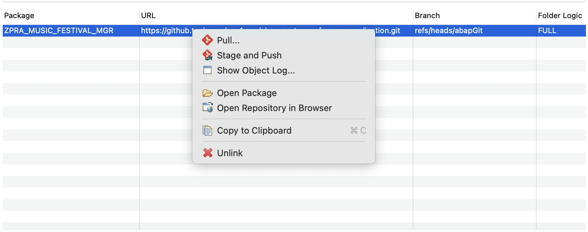

# Deploy and Run the Application

This tutorial offers a step-by-step guide on developing and deploying the Music Festival Manager. Initially, you set it up as a multitenancy solution. Later, you enhance it with SAP S/4HANA Cloud integration and additional features.

If you prefer a quick start without further explanation and want to the application with all features, follow these steps:

1. [Prepare your SAP BTP provider account, SAP Business Application Studio (BAS) and ABAP Development Tools (ADT) for development](./11-Prepare-BTP-Account-ADT-For-Dev.md).
2. [Enable the entitlements mentioned in the bill of materials of the multi-tenant application](./60-BillOfMaterials.md).
3. Create the software component in the SAP BTP ABAP environment. To create a software component, follow these steps:

    1. Navigate to your SAP BTP subaccount where the ABAP instance is created.
    2. Select the ABAP Environment Service Instance name under **Instances** on the **Instances and Subscriptions** tab in your subaccount. The ABAP landscape opens in new tab.
    3. Search for the **Manage Software Components** app and choose **Create**.
    4. Enter the following sample information:
        - **Namespace**: Z
        - **Name**: PRA_MF
        - **Description**: Music Festivals
        - **Type**: Development
    5. Choose **Create**. The software component is created and a page with it opens.
    6. Choose **Clone**. In the popup dialog, choose **OK**.

4. After creating the software component, you create an ABAP Cloud project in Eclipse. Then, you onboard the software component in Eclipse ADT.

    > **Note**: To create an ABAP Cloud project, follow the [Create ABAP Cloud Project](https://developers.sap.com/tutorials/abap-environment-create-abap-cloud-project.html) tutorial.
    > Once done, you include the software component into the project. Right-click on *Favorite Packages* under your *project* and choose **Add package**. Select the software component created above, for example ZPRA_MF. The software component is present in your local system in ADT.

5. You have to create the following packages manually under your generated package for software component.

    1. **ZPRA_MF_SERVICE** - Description: Music Festivals - Data Model and Services)
    2. **ZPRA_MF_UI_MNG_MUSIC_FESTS** - Description: Music Festivals - Fiori App - Manage Music Fests
    3. **ZPRA_MF_UI_MNG_VISITORS** - Description: Music Festivals - Fiori App - Manage Visitors

    > **Note**: For detailed, step-by-step instructions on creating packages, refer to the [Package Creation](./12-Develop-BTP-ABAP-RAP-Application.md#package-creation) section.

6. [Import the Music Festival Manager application from your abapGit repository into your ABAP environment in ADT](https://help.sap.com/docs/btp/sap-business-technology-platform/import-content-from-abapgit-repository-into-abap-environment).

    - **GitHub URL** - **https://github.com/SAP-samples/abap-partner-reference-application**
    - **Branch** - *main*

7. Pull the repository by right-clicking on the `ZPRA_MF` package name under the abapGit repositories window and choose **Pull**.

    

    > **Note**: The pull operation doesn't succeed initially because the SAP Fiori application hasn't been deployed yet. Consequently, the ABAP objects related to the SAP Fiori application aren't pulled.

8. Choose **Activate inactive ABAP development objects**  (Shortcut - Windows: `Ctrl + Shift + F3`; Mac: `Cmd + Shift + F3`) to activate all the objects that are pulled from the Git repository.

    > **Note:**
    > - The activation process may fail for some objects due to dependencies or missing components.
    > - Follow the sequence below to ensure a successful activation of the objects:

    **Activation Sequence:**
    1. **Activate Dictionary Objects**: Start by activating all dictionary objects. These include:
        - Data elements
        - Domains
        - Database tables
    2. **Activate Source Code Libraries**: Proceed to activate all source code libraries, such as classes.
    3. **Activate Remaining Objects (Excluding Specific Ones)**:
        - Activate all objects except the following:
            - `ZPRA_MF_MusicFestival`
            - `ZPRA_MF_Visitor`
            - `ZPRA_MF_UI_MUSICFESTIVAL_O4`
            - `ZPRA_MF_UI_VISITOR_O4`
            - `ZPRA_MF_LST`
            - `ZPRA_MF_LPT`
    4. **Activate All Except `ZPRA_MF_LST` and `ZPRA_MF_LPT`**: Activate all remaining objects except `ZPRA_MF_LST` and `ZPRA_MF_LPT`.

    > **Note:** Ensure that all ABAP objects, except `ZPRA_MF_LST` and `ZPRA_MF_LPT`, are activated successfully before proceeding to the next step.

9. Follow the steps below to publish the OData services in ADT:

    1. Open the ADT in Eclipse.
    2. Use the search functionality to locate the following service bindings:
        - `ZPRA_MF_UI_MUSICFESTIVAL_O4`
        - `ZPRA_MF_UI_VISITOR_O4`
    3. Select each and choose **Publish**.

    > **Note:**
    > - To quickly find an ABAP object in ADT, use the shortcut:
    >   - *Windows*: `Ctrl + Shift + A`
    >   - *Mac*: `Cmd + Shift + A`

10. Now, let's deploy the **Music Festival Manager** and **Visitors** SAP Fiori applications.

    > **Note:** Follow the [prerequisites](./14-Develop-Web-Application.md#prerequisites) steps before proceeding with SAP Fiori application development.

    1. Open SAP BAS and clone the [ABAP Partner Reference Application](https://github.com/SAP-samples/abap-partner-reference-application) repository.

    2. Open the terminal in the **abap-partner-reference-application** folder and run `cd fiori-apps/`.
    3. Replace the content below with your own:

        i. **Service URL** - Search for *<ABAP_SERVICE_URL>* and replace it with your ABAP service URL.

        ii. **Destination** - Search for *<DESTINATION_NAME>* and replace it with your destination name to connect to your ABAP service.

        iii. **Transport Request Number** - Search for <TRANSPORT_REQUEST> and replace it with your transport request number in the **ui5-deploy.yaml** file for both the Music Festival Manager and the Visitors applications.

        iv. **Authentication Type** - The `reentranceTicket` authentication type is mandatory when your SAP BAS and SAP BTP ABAP environment instances are in different SAP BTP subaccounts. If both instances are in the same SAP BTP subaccount, you can comment out this setting because it isn't required.

    4. **Steps to Deploy the Music Festival Application:**
       1. Navigate to the `musicfestivals` folder.
       2. Run the following commands in sequence:
           - `npm install` - Installs the required dependencies for the application.
           - `npm run deploy` - Deploys the application to the SAP BTP ABAP environment.

    5. **Steps to Deploy the Visitors Application:**
       1. Navigate to the `visitors` folder.
       2. Run the following commands in sequence:
           - `npm install` - Installs the required dependencies for the application.
           - `npm run deploy` - Deploys the application to the SAP BTP ABAP environment.

    > **Notes:**
    > - If the deployment fails on the first attempt, try to retrigger the deployment to resolve any transient issues.
    > - If you encounter an error stating "duplicate ID in SAP UI5 repository" during deployment, open your manifest.json file and update the id field under the "sap.app" section to a unique value. Then, try deploying again.
    > - Ensure that the deployment processes for both applications complete successfully before proceeding to the next steps.

11. After successfully deploying the SAP Fiori applications, return to the abapGit repositories window in ADT and perform the pull operation again to fetch the remaining ABAP objects related to SAP Fiori applications.

    - Right-click on the `ZPRA_MF` package name under the abapGit repositories window and choose **Pull**.

    > **Notes:**
    > - During the pull operation, verify and keep the following objects **unchecked**:
    >   - `ZPRA_MF_MF_UI5R`
    >   - `ZPRA_MF_VSTR_UI5R`
    >   - `ZPRA_MF_UI_MUSICFESTIVAL__00001_IBS`
    >   - `ZPRA_MF_UI_VISITOR_O4_0001_G4BA_IBS`
    >
    >   These objects are already created during the deployment of the SAP Fiori applications and don't need to be pulled again.
    > - Verify that all remaining objects are successfully pulled into the ABAP environment.

12. Once the pull operation is complete, activate all the newly pulled objects.

    > **Note:** Ensure that all objects are activated without errors before proceeding to the next steps.

13. Follow the steps below to publish the business role templates in ADT to enable the necessary roles for the application:

    1. Open the ADT in Eclipse.
    2. Use the search functionality to open the following objects:
        - Business role template `ZPRA_MF_DISP_BRT`
        - Business role template `ZPRA_MF_UPD_BRT`
        - Communication scenario `ZPRA_MF_CS_ENT_PROJ`
    3. Select each and choose **Publish Locally**.

14. The Service Consumption Model as explained in [Integration with SAP S/4HANA Cloud Public Edition](./40_Integration-with-S4-Public-Cloud.md#set-up-a-service-consumption-model) guide needs to be created as this is not imported by abapGit.
    1. First, delete the imported class `ZCL_PRA_MF_SCM_ENT_PROJ` as this will be generated in the next step.
    2. Please follow steps 1 and 2 of section [Import SAP S/4HANA Cloud Public Edition OData Services](./40_Integration-with-S4-Public-Cloud.md#import-sap-s4hana-cloud-public-edition-odata-services) and then continue with step 15 here.
15. Scope in the launchpad page and space templates to enable navigation and role-based access.
    1. Open the ADT in Eclipse.
    2. Use the search functionality to locate the following class:
        - `ZCL_PRA_MF_SCOPE_PG_SP_TMPLT`
    3. Right-click on the class and select **Run As > ABAP Application (Console)** to execute the scoping process.

16. [Create the business roles and assign the business users in the ABAP landscape](./22-Integration%20Application%20into%20Launchpad.md#creating-business-roles-and-assigning-business-users)

17. To integrate your SAP BTP application with the SAP S/4HANA Cloud Public Edition, follow the steps outlined in this guide: [Integration with SAP S/4HANA Cloud Public Edition](./40_Integration-with-S4-Public-Cloud.md).

You've successfully deployed your SAP Fiori applications.
