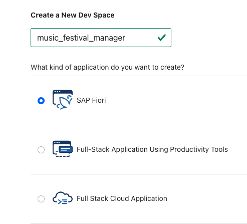

# Prepare Your SAP BTP Account, SAP BAS and ADT for Development

## Prerequisites

To start with this tutorial, you need an SAP Business Technology Platform (SAP BTP) global account. Additionally, install Eclipse IDE with the ABAP Development Tools (ADT) plugin for development.

## Set Up Your SAP BTP Subaccount

### Create Your Subaccount

1. Go to your SAP BTP global account cockpit.
2. Create a new *Multi-Environment* subaccount with the name `MusicFestivals` and choose a *Region* and *Service Provider*.

   > Refer to the official [SAP Regions and API Endpoints for the ABAP Environment](https://help.sap.com/docs/sap-btp-abap-environment/abap-environment/regions-and-api-endpoints-for-abap-environment?locale=en-US) to choose the appropriate Region and Service Provider for your ABAP environment.

   > The subdomain must be unique across the whole region. Therefore, include an abbreviation that uniquely identifies your company. Don't use special characters or capital letters. In addition, keep it short to avoid length restriction issues.

### Preparing Your Development Environment: SAP BTP ABAP Instance and Eclipse ADT Setup

ADT is primarily used for backend development in SAP RESTful ABAP Programming Model (RAP), enabling developers to define business objects, data models, and service behavior in the SAP BTP ABAP environment. In this section, you will configure the necessary development environment to start working with ABAP in SAP BTP. This involves two key steps:

1. **Creating an ABAP environment instance** within your SAP BTP subaccount.
2. **Configuring Eclipse IDE** with ADT to enable cloud-based ABAP development.

By the end of this section, you will have a fully functional environment ready to build, test, and deploy ABAP applications in the cloud.

> To download and install Eclipse and the ADT plugin, please follow the instructions provided in this [tutorial](https://developers.sap.com/tutorials/abap-install-adt.html).

#### Recommended: Automate Setup Using a Booster

The fastest and most efficient way to get started is by using the [Booster for ABAP Environment Setup](https://help.sap.com/docs/btp/sap-business-technology-platform/using-booster-to-automate-setup-of-abap-environment-optional). This guided procedure automates the creation and configuration of your ABAP environment, saving you time and minimizing the risk of configuration errors.

Once your environment is ready, follow the steps to [connect to your ABAP system](https://developers.sap.com/tutorials/abap-environment-create-abap-cloud-project.html) using Eclipse and ADT.

> **Note:**
> If you prefer a step-by-step guide or want to better understand the process, refer to the detailed setup guide below:
>
> 1. [Preparing to Set up an ABAP Environment](https://learning.sap.com/learning-journeys/setting-up-an-abap-environment-on-sap-btp/preparing-to-set-up-an-abap-environment_da85b82a-eb42-4eec-92f0-225b99402a2d)
> 2. [Setting up an ABAP Environment in SAP BTP](https://learning.sap.com/learning-journeys/setting-up-an-abap-environment-on-sap-btp/setting-up-an-abap-environment-in-sap-btp_d0e395ae-6bb3-468e-b141-0934a16c3f37)

### Enable SAP Business Application Studio

SAP Business Application Studio (BAS) is a powerful web-based development environment used for building the frontend of SAP Fiori applications. It offers comprehensive tools for designing, developing, and customizing user interfaces based on SAP Fiori design principles, enabling seamless integration with backend services and enhancing the overall user experience.

If you already have entitlements for SAP Business Application Studio and have completed the setup using the booster, your subscription is already active. Otherwise, in your newly created SAP BTP subaccount, only the default services will appear under *Entitlements*. In this case, you’ll need to configure the setup manually by following the steps below.

1. Go to the SAP BTP global account.
2. Go to **Entitlements** and **Entity Assignments**. 
3. Open the value help under **Subaccount/Directories** and select the corresponding SAP BTP subaccount, for example, *MusicFestivals*.
4. Choose **Edit** and **Add Service Plans**. 
5. Select the **SAP Business Application Studio** entitlement and choose an available plan.

   

6. Choose *A*dd 1 Service Plan** and save your changes. 
7. Go back to your SAP BTP subaccount. 
8. SAP Business Application Studio is now available in the **Entitlements** list. 
9. To create an instance of this service within the SAP BTP subaccount, go to **Service Marketplace**. As the service, select **SAP Business Application Studio** and choose **Create**.

   

10. The instance appears in the **Subscriptions** list.

    

11. When you first start it, access is denied because the user roles have not yet been assigned to this service instance. To assign them, go to **Security** and **Users**. 
12. Select your user and go to the assigned **Role Collections**. 
13. Select all the role collections of SAP Business Application Studio and confirm the assignment.

    

14. Three role collections have been added.

    

15. Now, you can start SAP Business Application Studio. If access is denied, wait a few seconds and try again. You may need to clear your browser cache. 

    

16. After you've started the development environment, create a new **Dev Space** for the development of this tutorial. Name it *music_festival_manager* and select **SAP Fiori**.

    

You've now successfully set up your SAP BTP subaccount and enabled SAP Business Application Studio.
