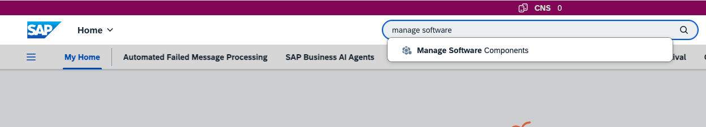
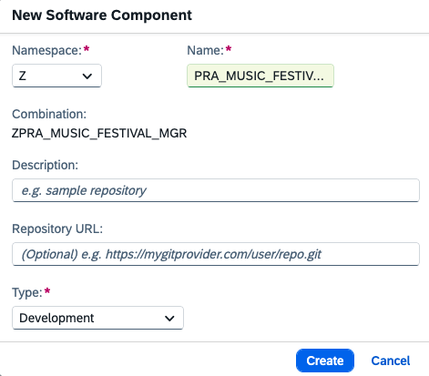
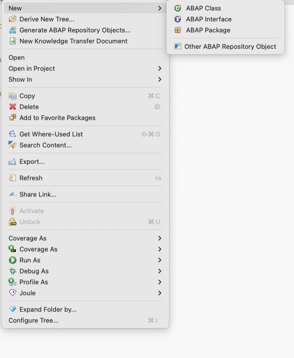
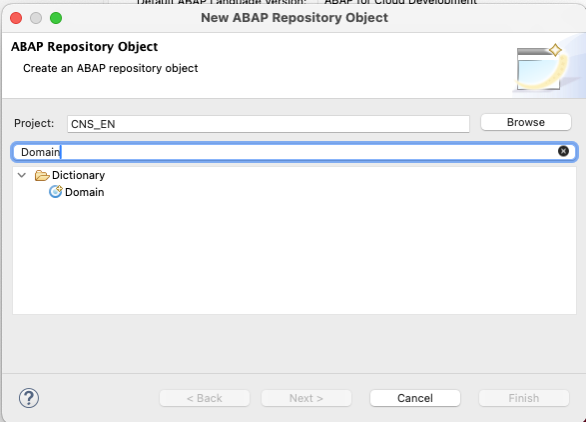
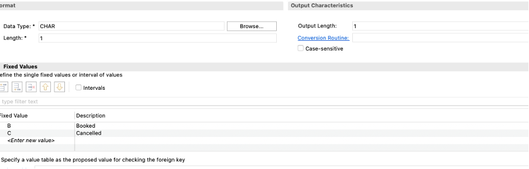
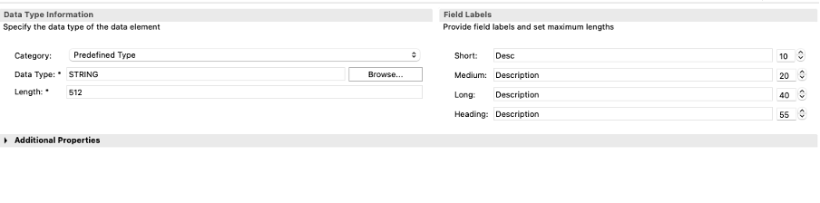
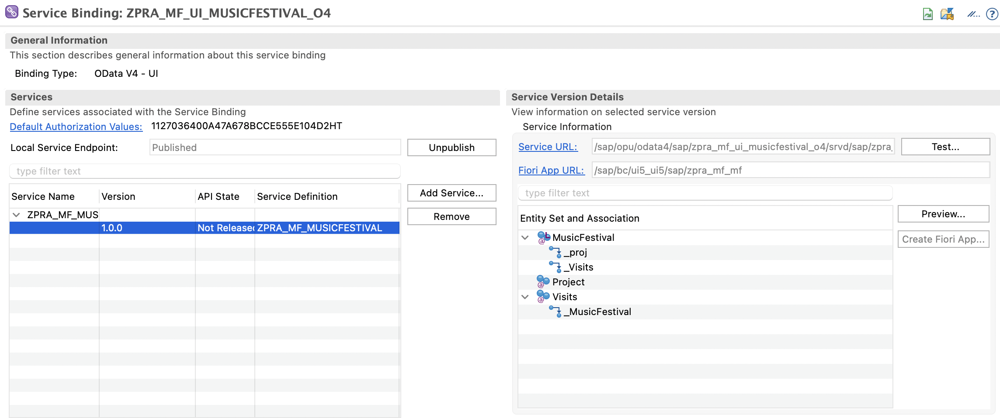

# Developing BTP ABAP RAP Applications - Data Modeling and OData Service Generation

- [Developing BTP ABAP RAP Applications - Data Modeling and OData Service Generation](#developing-btp-abap-rap-applications---data-modeling-and-odata-service-generation)
  - [Software Component Creation](#software-component-creation)
    - [Software Component Availability in Eclipse ADT](#software-component-availability-in-eclipse-adt)
    - [Create ABAP Cloud Project:](#create-abap-cloud-project)
  - [Package Creation](#package-creation)
  - [Database Table](#database-table)
    - [Domains](#domains)
      - [Create a Domain](#create-a-domain)
    - [Data Elements](#data-elements)
      - [Create Data Elements](#create-data-elements)
    - [Database Table Creation](#database-table-creation)
      - [Music Festival Table Creation](#music-festival-table-creation)
      - [Visitor Table Creation](#visitor-table-creation)
      - [Table for Maintaining Associations Between Entities](#table-for-maintaining-associations-between-entities)
  - [Source Code Library](#source-code-library)
  - [Transactional UI Services Generation](#transactional-ui-services-generation)
    - [Service Definition](#service-definition)
    - [Service Binding](#service-binding)
    - [Local Publishing and Testing](#local-publishing-and-testing)
  - [Message Class](#message-class)


You can develop applications using SAP BTP ABAP in just a few steps. The high-level diagram below illustrates the end-to-end development process in SAP BTP ABAP environment using the ABAP RESTful Application Programming Model (RAP). This process starts from defining the data model using CDS entities. It then moves through behavior and service exposure layers. Finally, it culminates in a SAP Fiori elements UI. This approach enables rapid, metadata-driven enterprise application development.


                                                          [Database]
                                                              ↓
                                                         [CDS Entity]
                                                              ↓ 
                                                 [Behavior Definition + Class]
                                                              ↓
                                                     [Service Definition]
                                                              ↓
                                                      [OData V4 Binding]
                                                              ↓
                                                    [SAP Fiori Elements UI]


To create an ABAP RAP application on SAP BTP, you need to create several artifacts to achieve development object creation. These include:

1. Software Component
   
   - A software unit delivered and versioned by SAP or partners. It contains a collection of packages, classes, function modules, etc.
   - In SAP BTP ABAP environment, software components function similarly to reusable libraries, such as dependencies in abapGit. Examples include: SAP_APPL, S4CORE, and ZPARTNER_EXT.
   
2. Package
   
      - A logical container used to organize development objects (CDS views, classes, services, etc.).
      - Helps with transport management and modular design.
        
3. Database (DB) Tables
   
      - Physical tables in the ABAP Dictionary that persist data. In RAP or CAP, you define data models through CDS views that map to underlying tables.
      - Types of DB tables:
  
         o Transparent tables

         o Views and CDS views: These provide logical representations of DB tables.
        
4. Source Code Library
   
     -  Libraries that can be shared across packages or projects. They are collections of reusable ABAP code, such as:
  
         o Classes

         o Function groups

         o Interfaces
      
5. Transactional UI Services
   
   - SAP Fiori apps or UI services that allow users to perform business transactions (create, update, delete). In RAP, they are created using service definitions and service bindings (OData V4).
   - It automatically supports:
      o Draft handling
      o Validation and determinations
      o Actions, such as approve or submit
   - It can be launched through:
      o SAP Fiori launchpad
      o SAP Build Work Zone
      o Integrated into SAP S/4HANA Fiori catalogs/groups
6. Message Class
   
    - Used to define and manage standardized messages (errors, warnings, information). They are used in exception handling, UI messages, or API responses.
    - Example: ZMSG001, with entries like:
  
      o 001: Customer does not exist.
      
      o 002: Order has already been approved.
   
Let's look into it in detail:

## Software Component Creation

A software component contains all coding and development objects for at least one application. It should be able to run independently.
To create a software component, follow these steps:

1. Navigate to your SAP BTP subaccount where the ABAP instance is created.
2. Select the ABAP Environment Service Instance name under **Instances** on the **Instances and Subscriptions** tab in your subaccount. The ABAP landscape opens in new tab.
3. Search for the **Manage Software Components** app and choose **Create**.
   
4. Enter the following sample information:
   - **Namespace**: Z
   - **Name**: PRA_MUSIC_FESTIVAL_MGR 
   - **Description**: Music Festivals 
   - **Type**: Development
   
    

5. Choose **Create**. The software component is created and a page with it opens.
6. Choose **Clone**. In the popup dialog, choose **OK**.

### Software Component Availability in Eclipse ADT

After creating the software component, you create an ABAP Cloud project in Eclipse. Then, you onboard the software component in Eclipse ADT.

### Creating ABAP Cloud Project
   To create an ABAP Cloud project, follow the [Create ABAP Cloud Project](https://developers.sap.com/tutorials/abap-environment-create-abap-cloud-project.html) tutorial.
   
   Once done, you include the software component into the project. Right-click on your project and choose **Add package**. Select the software component created above, for example **ZPRA_MUSIC_FESTIVAL_MGR**. The software component is present in your local system in ADT.

To create further artifacts, follow the sections below.

## Package Creation

Before creating the DB table, you need to create a package that holds all the application metadata.

1. In ADT, go to the Project Explorer, right-click on the **ZPRA_MUSIC_FESTIVAL_MGR** software component package and choose **New > ABAP Package**.
2. Maintain the required information:

   - **Name**: ZPRA_MF_SERVICE
   - **Description**: Music Festivals - Data Models and Services
3. Choose **Next**. The system asks for the application component. You can skip this if you don't know it. 

4. Choose **Next**. A dialog box requesting the transport request is displayed. 
- If there is an existing transport request, select that transport request and choose **Finish**.
- If there is no existing transport request, choose **Create New Request** and enter a description, for example Music Festival Manager application, and choose **Finish**.

## Database Table
In the SAP BTP ABAP Environment, a database table is a structured object used to store persistent data in the underlying SAP HANA database, similar to how tables work in traditional ABAP on-premise systems but with some modern cloud-specific approaches.

A database table requires that the attributes are defined in the table. Each attribute requires a type, such as data types or domains, based on the requirements. Let's first explore how to define these attributes, followed by the process of creating the database table.


### Domains
In SAP BTP ABAP environment, a domain is a data type definition used in the ABAP Dictionary to define the technical attributes (such as data type, length, and value range) of a field that is reused across multiple data elements or tables.

#### Create a Domain
  1. Select the package where the domain needs to be created in, for example **ZPRA_MF_SERVICE** (expand the package you've just created to see **ZPRA_MF_SERVICE**).
  2. Right-click on the package and choose **New > Other ABAP Repository Object**.
   
        

   3. Search for Domain and select it. Choose **Next**.
   
       

   4. Enter the following information:
      - **Name**: ZPRA_MF_VISIT_STATUS_CODE
      - **Description**: Visitor status code value list
   5. Choose **Next** and select a transport request (either a new or an existing one).
   6. Choose **Finish**.

   7. Select the domain to enter the FIXED values below:

        | Fixed Values | Description | 
        |:---:|:---:|
        | B   | Booked     | 
        | C   | Canceled   | 

   8. Additionally, set the **Data Type** as *CHAR*.
   
       

The **ZPRA_MF_VISIT_STATUS_CODE** domain is created and can be used in data elements.
Similarly, you can create other domains for the entire application. Below is the list of the domains used in the **Music Festival** application:

| Domain |  Type | Length | Description |
|:-----------|:------------|:------------|:------------|
| ZPRA_MF_MUSIC_FEST_STATUS_CODE   |   CHAR    |       1| |

   Find the below FIXED values for the above **ZPRA_MF_MUSIC_FEST_STATUS_CODE** domain:

  | Fixed Values | Description | 
  |:---:|:---:|
  | I   | In-Preparation     | 
  | P   | Published   | 
  | C   | Canceled   |
  | F   | Fully Booked   |


###  Data Elements
In SAP BTP ABAP environment, a data element is a semantic layer of the data type definition in the ABAP Dictionary. It builds on top of a domain (or directly defines a type) and provides:
   - Meaningful descriptions (short, medium, long text labels)
   - Field labels for UI and metadata
   - Connection to domain (for technical details)
     
#### Creating Data Elements
   1. Select the package where the domain needs to be created, for example **ZPRA_MF_SERVICE** (expand the package you've just created to see **ZPRA_MF_SERVICE**).
   2. Right-click on Dictionary and choose **New > Data Elements**.
   3. Enter the following information:
      - **Name**: ZPRA_MF_DESCRIPTION
      - **Description**: Description
   4. Choose **Next** and select a transport request (either a new or an existing one).
   5. Choose **Finish**.
   6. Open the data element you've created and set the following values:
      - **Category**: Predefined Type 
      - **Data Type**: String
      - **Field Labels**: Description

           

The **ZPRA_MF_DESCRIPTION** data element is created and can be used in DB tables. 
Similarly, you can create other data elements for the entire application. Below is the list of the data elements used in the **Music Festival** application:

| Data Element |  Type | Length | Description |
|:-----------|:------------|:------------|:------------|
| ZPRA_MF_CURRENCY_CODE      |   CUKY       |       5 | Currency|
| ZPRA_MF_DESCRIPTION    |   String       |       512 | Description|
| ZPRA_MF_EMAIL      |   CHAR       |       255| Email|
| ZPRA_MF_FREE_VISITOR_SEATS    |   INT4     |       10| Available Seats|
| ZPRA_MF_MAX_VISITORS_NUMBER   |   INT4       |       10 | Max Number of Visitors|
| ZPRA_MF_NAME     |   STRING      |       256 | Name|
| ZPRA_MF_DATE_TIME     |   UTCLONG     |       27| Event Date|
| ZPRA_MF_PRICE    |   DEC       |       6,2 | Price|
| ZPRA_MF_PROJ_NAME   |   CHAR     |       30| Project Name|
|  ZPRA_MF_TITLE |   CHAR       |       255 | TITLE|
| ZPRA_MF_ARTIST_INDICATOR      |   ABAP_BOOLEAN     |       1 | Artist|


### Database Table Creation

You need to create a DB table to store the music festivals and visitor data.
A music festival event entity defines general event data, such as the event date, time, event title, event description, visitor fee amount, etc. The visitor entity has details about visitors such as visitor name, email, etc.

#### Music Festival Table Creation

1. Right-click on your **ZPRA_MF_SERVICE** ABAP package and choose **New > Other ABAP Repository Object**.

2. Search for database table, select it, and choose **Next**.

3. Maintain the required information and choose **Next**.

 - **Name**: ZPRA_MF_A_MF
 - **Description**: Music festivals data

4. Select a transport request and choose **Finish** to create the DB table.

5. Replace the default code with the attributes required for the business use case. For example, for a **Music Festival** app, the following details can be added:
   
   > Note: You also need to create the other data elements used in the table below.

    ```abap
      @EndUserText.label : 'Music festivals data'
      @AbapCatalog.enhancement.category : #NOT_EXTENSIBLE
      @AbapCatalog.tableCategory : #TRANSPARENT
      @AbapCatalog.deliveryClass : #A
      @AbapCatalog.dataMaintenance : #RESTRICTED
      define table zpra_mf_a_mf {

         key client            : abap.clnt not null;
         key uuid              : sysuuid_x16 not null;
         title                 : zpra_mf_title;
         description           : zpra_mf_description;
         event_date_time       : zpra_mf_date_time;
         max_visitors_number   : zpra_mf_max_visitors_number;
         free_visitor_seats    : zpra_mf_free_visitor_seats;
         visitors_fee_amount   : zpra_mf_price;
         visitors_fee_currency : zpra_mf_currency_code;
         status                : zpra_mf_music_fest_status_code;
         created_by            : abp_creation_user;
         created_at            : abp_creation_utcl;
         last_changed_at       : abp_lastchange_utcl;
         local_last_changed_at : abp_lastchange_utcl;
         last_changed_by       : abp_lastchange_user;
         project_id            : abap.char(24);

      }
    ```

6. Save and activate the changes.


#### Visitor Table Creation

Similarly, a visitor table can be created following the steps provided for DB tables. 
1. Maintain the basic information:
   - **Name**: ZPRA_MF_A_VSTR
   - **Description**: Visitors data
2. Reference for the same:

    ```abap
      @EndUserText.label : 'Visitors data'
      @AbapCatalog.enhancement.category : #NOT_EXTENSIBLE
      @AbapCatalog.tableCategory : #TRANSPARENT
      @AbapCatalog.deliveryClass : #A
      @AbapCatalog.dataMaintenance : #RESTRICTED
      define table zpra_mf_a_vstr {

         key client            : abap.clnt not null;
         key uuid              : sysuuid_x16 not null;
         name                  : zpra_mf_name;
         email                 : zpra_mf_email;
         created_by            : abp_creation_user;
         created_at            : abp_lastchange_utcl;
         last_changed_at       : abp_lastchange_utcl;
         last_changed_by       : abp_lastchange_user;
         local_last_changed_at : abp_lastchange_utcl;

      }
    ```

4. Save and activate the changes.

#### Table for Maintaining Associations Between Entities

Multiple music festivals can have multiple visitors. To manage the n-n association between the two tables, a new table is created. This table holds the primary keys from both tables to establish the association reference. 

This table is created as described for DB tables.
1. Fill in the basic information: 
    - **Name**: ZPRA_MF_A_VST 
    - **Description**: Visits data
2. Reference for the same:

    ```abap
   @EndUserText.label : 'Visits data'
   @AbapCatalog.enhancement.category : #NOT_EXTENSIBLE
   @AbapCatalog.tableCategory : #TRANSPARENT
   @AbapCatalog.deliveryClass : #A
   @AbapCatalog.dataMaintenance : #RESTRICTED
   define table zpra_mf_a_vst {

      key client            : abap.clnt not null;
      key uuid              : sysuuid_x16 not null;
      parent_uuid           : sysuuid_x16;
      visitor_uuid          : sysuuid_x16;
      artist_indicator      : zpra_mf_artist_indicator;
      status                : zpra_mf_visit_status_code;
      local_last_changed_at : abp_lastchange_utcl;

   }
    ```

3. Save and activate the table.

The above table created has the references of both music festivals as well as visitors in the same association table.
For more information on associations, see [Association](./15-Core-Data-Services.md#associations).

## Source Code Library

You can implement an ABAP class for business logic for the entities created above.

1. Right-click your **ZPRA_MF_SERVICE** ABAP package and select **New > ABAP Class**.

2. Maintain the required information and choose **Next**.

 - **Name**: ZCL_XX
 - **Description**: Generate sample data

3. Select a transport request and choose **Finish** to create the class.

The class serves multiple purposes across various utility tasks. It includes development, data manipulation, and preliminary calculations.

## Transactional UI Services Generation

To visualize the application UI built on top of all configurations, you need to create certain artifacts. These artifacts control the behavior of the end-user application. You can define determinations, validations, actions, mandatory fields, and more for these artifacts using transactional services generation.

Additionally, you can create OData v4-based UI services with the built-in ADT generator. The generated business services are transactional, draft-enabled, and enriched with UI semantics for generating the SAP Fiori elements app.

1. Right-click your **ZPRA_MF_A_MF** DB table and choose **Generate ABAP Repository Objects**.

2. Select the ODATA UI service generator under ABAP RESTful Application Programming Model and choose **Next**.

3. Select the package in which you want to generate the objects in (**ZPRA_MF_SERVICE** in this scenario) and choose **Next**.

4. Maintain the required information on the **Configure Generator** dialog. For that, navigate through the wizard tree (Business Objects, Data Model, etc). Enter the artifact names provided in the table below, and choose **Next**.

      | RAP Layer          | Artifacts                   | Artifacts name                                                 |
      | :----------------- | :-------------------------- | :---------------------------------------------------           |
      | General            |                             |                                                                |
      |                    |                             | Referenced Object: ZPRA_MF_A_MF                                |
      |                    |                             | Project Name: PRA_MF_A_MF                                      |
      | Business Object    |                             |                                                                |
      |                    | Data Model                  | CDS Entity Name: ZPRA_MF_R_MusicFestival                       |
      |                    |                             | CDS Entity Name Alias: MusicFestivals                          |
      |                    | Behavior                    | Implementation Behavior Class: ZBP_PRA_MF_R_MUSICFESTIVAL      |
      |                    |                             | Draft Table Name: ZPRA_MF_D_MF                                 |
      | Service Projection | Service Projection Entity   | CDS Entity Name:  ZPRA_MF_C_MUSICFESTIVALTP                    |
      |                    | Service Projection Behavior | Behavior Implementation Class: ZBP_PRA_MF_C_MUSICFESTTP        |
      | Business Service   |                             |                                                                |
      |                    | Service Definition          | Service Definition Name:  ZPRA_MF_MUSICFESTIVAL                |
      |                    | Service Binding             | Service Binding Name:  ZPRA_MF_UI_MUSICFESTIVAL_O4             |
      |                    |                             | Binding Type: OData V4 - UI                                    |

   For more information on naming conventions, see [Naming Conventions in the Virtual Data Model](https://help.sap.com/docs/SAP_S4HANA_CLOUD/c0c54048d35849128be8e872df5bea6d/8a8cee943ef944fe8936f4cc60ba9bc1.html) and [Clean ABAP for development](https://github.com/SAP/styleguides/blob/67d9f421b8061d1077dfd28c44b627f6c7df5ec1/clean-abap/CleanABAP.md).

5. Verify the maintained entries and choose **Next** to confirm.

6. Select the transport request and choose **Finish**.

7. Go to the Project Explorer and select the **ZPRA_MF_SERVICE** package. Refresh it by choosing F5, and check all generated ABAP repository objects.

8. Repeat the steps for the **ZPRA_MF_A_VSTR** entity.

   In the table below are the naming conventions used for **ZPRA_MF_A_VSTR** entity:

  | RAP Layer          | Artifacts                   | Artifacts name                                                 |
  | :----------------- | :-------------------------- | :---------------------------------------------------           |
  | General            |                             |                                                                |
  |                    |                             | Referenced Object: ZPRA_MF_A_VSTR                              |
  |                    |                             | Project Name: ZPRA_MF_A_VSTR                                   |
  | Business Object    |                             |                                                                |
  |                    | Data Model                  | CDS Entity Name: ZPRA_MF_R_VISITOR                             |
  |                    |                             | CDS Entity Name Alias: Visitors                                |
  |                    | Behavior                    | Implementation Behavior Class: ZBP_PRA_MF_R_VISITOR            |
  |                    |                             | Draft Table Name: ZPRA_MF_D_VSTR                               |
  | Service Projection | Service Projection Entity   | CDS Entity Name: ZPRA_MF_C_VISITORTP                           |
  |                    | Service Projection Behavior | Behavior Implementation Class: ZBP_PRA_MF_C_VISITORTP          |
  | Business Service   |                             |                                                                |
  |                    | Service Definition          | Service Definition Name: ZPRA_MF_VISITOR                       |
  |                    | Service Binding             | Service Binding Name: ZPRA_MF_UI_VISITOR_O4                    |
  |                    |                             | Binding Type: OData V4 - UI                                    |


You also need to create manual artifacts for the **Visit** entity. In the table below are the naming conventions used for the same:

  | Type               | Artifacts                   | Artifacts name                                                 |
  | :----------------- | :-------------------------- | :---------------------------------------------------           |
  |                    |  Data Definition            |  [ZPRA_MF_I_Visit_Status_VH](../src/zpra_mf_service/zpra_mf_i_visit_status_vh.ddls.asddls ) <br> [ZPRA_MF_I_Visitor](../src/zpra_mf_service/zpra_mf_i_visitor.ddls.asddls) <br>[ZPRA_MF_R_VISIT](../src/zpra_mf_service/zpra_mf_r_visit.ddls.asddls)<br>[ZPRA_MF_C_VISITTP](../src/zpra_mf_service/zpra_mf_c_visittp.ddls.asddls)|
  |                    |                             |                              |
  | Calculation class Annotation |  Data Definition            | Adjustment needed to add calculated class in Data Definition [ZPRA_MF_C_MusicFestivalTP](../src/zpra_mf_service/zpra_mf_c_musicfestivaltp.ddls.asddls#L28)                                |
  |  Calculation class Implementation  |   Source Code Library                        |     [zcl_pra_mf_calc_visit_elements](../src/zpra_mf_service/zcl_pra_mf_calc_visit_elements.clas.abap)                                                           |
  |                    | Behaviour definition                  | Adjustment needed to add Visit in Music Behaviour definition [ZPRA_MF_R_MusicFestival](../src/zpra_mf_service/zpra_mf_r_musicfestival.bdef.asbdef#L103)                         |
  |                    |   Behaviour definition                         |  Draft table generation using Quick Assist view in [ZPRA_MF_R_MusicFestival](../src/zpra_mf_service/zpra_mf_r_musicfestival.bdef.asbdef#L103)<br> Adjustments in Music Projection Behaviour View  [ZPRA_MF_C_MusicFestivalTP](../src/zpra_mf_service/zpra_mf_c_musicfestivaltp.bdef.asbdef#L35)                         |
  | Business Service   |                             |                                                                |
  |                    | Service Definition          | Adjustment in Service Definition [ZPRA_MF_MusicFestival](../src/zpra_mf_service/zpra_mf_musicfestival.srvd.srvdsrv)<br> [ZPRA_MF_VISITOR](../src/zpra_mf_service/zpra_mf_visitor.srvd.srvdsrv)                       |

For more information on the artifacts mentioned above, see [Core Data Services](./15-Core-Data-Services.md).

### Service Definition

A business service definition, often referred to as a service definition, describes which CDS entities of a data model are exposed to enable a specific business service, for example, music festival creation or publishing handling. It is an ABAP Repository object that describes the consumer-specific but protocol-agnostic perspective on a data model. It can directly access the standard ABAP Workbench functionality, such as transports, syntax checks, element information, and activation.
For more information, see [Service Definition](https://help.sap.com/docs/ABAP_PLATFORM_NEW/fc4c71aa50014fd1b43721701471913d/b09e4d53bfca4544a9f8910bcc2cd9d6.html).

### Service Binding

The business service binding, often referred to as a service binding, is an ABAP Repository object used to bind a service definition to a client-server communication protocol such as OData. Like any other repository object, the service binding uses the proven infrastructure of the ABAP Workbench, including the transport functionality.
For more information, see [Service Binding](https://help.sap.com/docs/ABAP_PLATFORM_NEW/fc4c71aa50014fd1b43721701471913d/b58a3c27df4e406f9335d4b346f6be04.html).

### Local Publishing and Testing

1. Double-click on Service Binding and choose **Publish**.
   > Note: It will take some time to complete the publishing action.
2. Once completed, select the entity set and choose **Preview** to view the UI and test the local changes.
   
   

3. The app runs in *Preview* mode in a local system to test.

As the app runs locally, we can now proceed on how to [Develop Business Logic](./13-Develop-Business-Logic.md).

## Message Class
Messages play a crucial role in guiding and validating consumer and user actions. They help avoid and resolve problems. Effective messages communicate issues to consumers or users. Well-designed messages assist in recognizing, diagnosing, and resolving issues.
For more information, see [Message Handling](https://help.sap.com/docs/abap-cloud/abap-rap/messages).

In the current application, refer to this [example](../src/zpra_mf_service/zcm_pra_mf_messages.clas.abap) for message handling.
