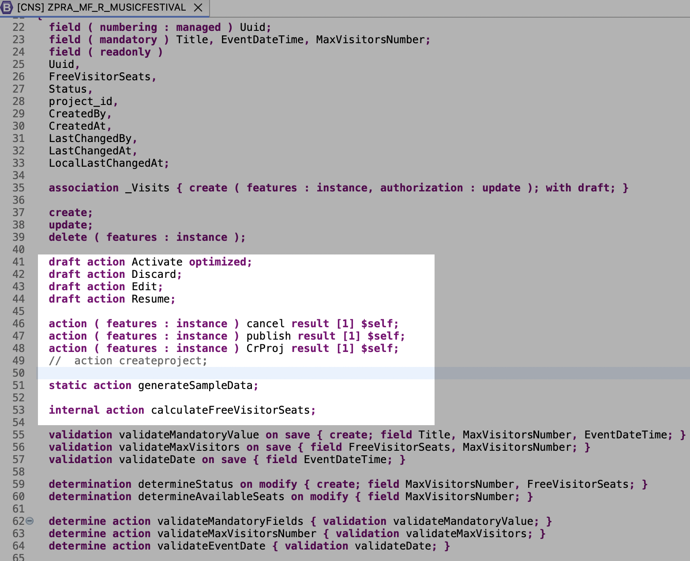
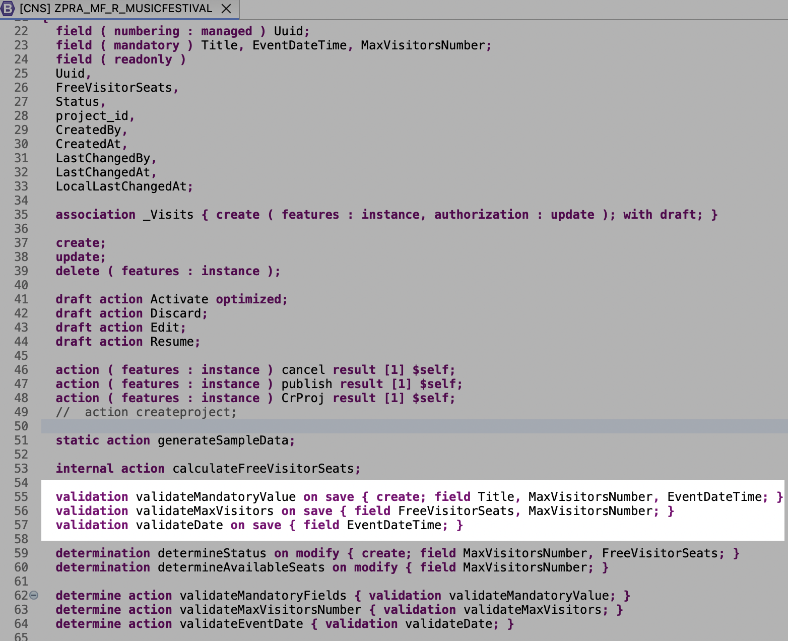
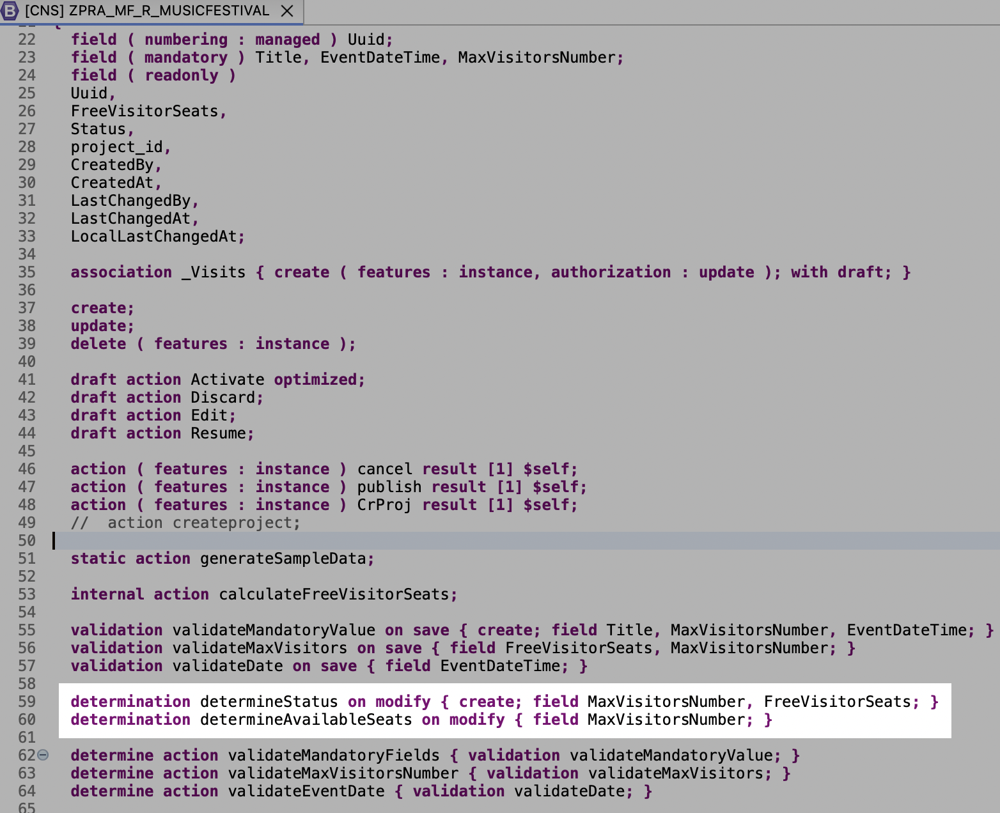

# Developing Business Logic for RAP Business Objects
## Actions

RAP actions are non-standard RAP Business Object (BO) operations that modify the state of an entity instances. You must implement custom logic in the RAP handler method FOR MODIFY.

There are three kinds of actions available:

- Non-factory actions: These actions implement custom business logic to modify existing instances of a RAP BO.
- Factory actions: Use factory actions to create new instances of a RAP BO entity.
- Save actions: Save actions can be either non-factory or factory actions. Thry are specifically characterized by the use of the save addition in their definition.

Creating an action involves the following steps:

1. **Define the action in the behavior definition**: Specify the action's name, parameters, and when it should be triggered.
2. **Expose the action in the BO projection layer**: Make the action available for consumption in the OData service.
3. **Implement the action logic**: Write the ABAP code that defines what happens when the action is executed.

In our application, we have defined different kinds of actions to handle various scenarios:

- `publish` - This action on the **Music Festival Event** business object lets the user publish an event, making it available for visitors to book. This action is an example of an *instance-bound non-factory action*. It modifies the state of an event instance by setting its status to **Published**.

  ```abap
  action ( features : instance ) publish result [1] $self;
  ```

- `generateSampleData` - This action on the **Music Festival Event** business object lets the user generate sample data for events. This action is an example of a *static non-factory action*. It can be executed on the entity as a whole, generating multiple event instances with predefined data.

  ```abap
  static action generateSampleData;
  ```

A complete set of [actions](../src/zpra_mf_service/zbp_pra_mf_r_musicfestival.clas.locals_imp.abap) can be found in the behavior definitions of the respective business objects.


See [Behavior Definition for Music Festival](../src/zpra_mf_service/zpra_mf_r_musicfestival.bdef.asbdef) for more information.

Let's create an action:
1. Navigate to the behaviour definition of Music Festival, for example **ZPRA_MF_R_MusicFestival**.
2. Add the action name and trigger point to the behavior definition:
    ```abap
        action ( features : instance ) publish result [1] $self;
    ```
3. Hover over the validation name and press Ctrl+1 (Windows) or Command+Shift+1 (Mac) to open the Quick Assist view. Then, choose **Add method for action publish...**.
   
    

4. As a result, the method for the **Publish** action is added to the local handler class, *lcl_handler*, in the behavior pool of the Music Festival entity.
5. Add the implementation for an action. Refer to [Publish action](../src/zpra_mf_service/zbp_pra_mf_r_musicfestival.clas.locals_imp.abap) for more information.

 6. Save and activate the action.
 7. You can now test the action to see if a user is able to publish an event in the app.

### Action on UI:
To make the action visible on the UI, add the following code snippet to the metadata extension of any UI facet.
```abap
    @UI.lineItem:[
    
    
    { position: 60,
    type: #FOR_ACTION,
    dataAction: 'publish',
    label: 'Publish' }]
    @UI.selectionField: [ {
      position: 10 
    } ]
```
### Action Availability in Projection Behavior  
To make the action available to use, we need to make it available in the projection behavior for Music Festival, **ZPRA_MF_C_MusicFestivalTP**. Therefore, add the below code snippet:
```abap
  use action publish;
```
### More Information

- [Actions on SAP Help Portal](https://help.sap.com/docs/abap-cloud/abap-rap/actions?locale=en-US&version=sap_btp)
- [Actions ABAP EML](https://help.sap.com/doc/abapdocu_cp_index_htm/CLOUD/en-US/ABENBDL_ACTION.html)
- Detailed developing actions example:
  - [Flight Scenario](https://help.sap.com/docs/abap-cloud/abap-rap/developing-actions?version=sap_btp)
  - [RAP100](https://github.com/SAP-samples/abap-platform-rap100/tree/main/exercises/ex06)
- [Implementation Contract](https://help.sap.com/docs/abap-cloud/abap-rap/implementation-contract-action?version=sap_btp)

## Validations

A RAP validation checks the consistency of RAP BO instances based on trigger conditions. The RAP framework automatically invokes a validation if the trigger condition is fulfilled. Validations can be triggered by operations, fields, or both.

Creating a validation involves two main steps:

1. **Define the validation in the behavior definition**: Specify when the validation should be triggered.
2. **Implement the validation logic**: Write the code that is executed when the validation is triggered.

>Note: Front-end and back-end validations ensure data consistency. As the names suggest, front-end validations are performed on the UI. They improve the user experience by providing faster feedback and avoiding unnecessary roundtrips. In the RAP context, front-end validations are defined using CDS annotations or UI logic. Back-end validations are performed on the back end. They are defined in the business object behavior definition and implemented in the respective behavior pools. Front-end validations can be easily bypassed, for example, by using EML APIs in the RAP context. Therefore, back-end validations are essential for ensuring data consistency. This document focuses on back-end validations.

In our application, we define different kinds of validations to handle various scenarios:

- `validateMandatoryValue` - Checks that all mandatory fields are provided during the creation of an event or when any of the specified fields are modified.

  ```abap
  validation validateMandatoryValue on save { create; field Title, MaxVisitorsNumber, EventDateTime; }
  ```

  - *Trigger Time* - The validation is triggered during a save of the Music Festival Event.
  - *Trigger Operations* - Runs specifically during the creation of an event instance or when any of the following fields are modified: Title, MaxVisitorsNumber, or EventDateTime.

- `validateDate` - Checks that the event date is in the future when saving an 'Event' BO. It ensures that users can't create or modify events with a date that has already passed. This maintains data integrity and prevents scheduling errors. This is an example of a validation triggered when users modify specific fields.

  ```abap
  validation validateDate on save { field EventDateTime; }
  ```

  - *Trigger Time* - The validation is triggered during a save of the music festival event.
  - *Trigger Operations* - Triggered when the *Event Date Time* field is modified.

> Note - The [trigger time](https://help.sap.com/docs/ABAP_PLATFORM_NEW/fc4c71aa50014fd1b43721701471913d/f70e8ef245dc4bda8353a4a113843361.html?locale=en-US&q=association#trigger-time) defines at what time the trigger condition of a validation is evaluated. For validations, only the trigger time on save can be stated. They are executed during the **checkBeforeSave** method as part of the save sequence in the behavior implementation.

A complete set of validations can be found in the behavior definitions of the respective business objects.

Let's create one validation:
1. Navigate to the behaviour definition of the Music Festival, for example **ZPRA_MF_R_MusicFestival**.
2. Add a validation name and trigger point to the behavior definition:
    ```abap
        validation validateMandatoryValue on save { create; update; }
    ```
3. Hover over the validation name and press Ctrl+1 (Windows) or Command+Shift+1 (Mac) to open the Quick Assist view. Then, choose **Add method for validation validateMandatoryValue...**.
   
    

4. As a result, a method for validation named **validateMandatoryValue** is added to the local handler class *lcl_handler* of the behavior pool of the Music Festival entity.
5. Add the implementation for the validation. Refer to [ValidateMandatoryValue](../src/zpra_mf_service/zbp_pra_mf_r_musicfestival.clas.locals_imp.abap) for more information.

6. Save and activate the validation.
7. The validation can now be tested on a running app when a user tries to delete an event that is already published.
   
For more information, see [Local Class with implementation for validation](../src/zpra_mf_service/zbp_pra_mf_r_musicfestival.clas.locals_imp.abap) and [Behavior Definition for Music Festival](../src/zpra_mf_service/zpra_mf_r_musicfestival.bdef.asbdef).

### More Information

- [Validations SAP Help](https://help.sap.com/docs/abap-cloud/abap-rap/validations)
- [Validations ABAP EML](https://help.sap.com/doc/abapdocu_cp_index_htm/CLOUD/en-US/ABENBDL_VALIDATIONS.html)
- Detailed developing Validations example: 
  - [Flight Scenario](https://help.sap.com/docs/abap-cloud/abap-rap/developing-validations?version=sap_btp)
  - [RAP100](https://github.com/SAP-samples/abap-platform-rap100/tree/main/exercises/ex05)

## Determinations

A determination modifies instances of RAP business objects based on trigger conditions. A determination is implicitly invoked by the RAP framework if the trigger condition of the determination is fulfilled. Determinations can be triggered by trigger operations, trigger fields, or both.

Creating a determination involves two main steps:

1. **Define the determination in the behavior definition**: This is where you specify when the determination should be triggered.
2. **Implement the determination logic**: This is where you write the code that will be executed when the determination is triggered.

In context of our application, we have defined different kinds of determinations to handle different scenarios:

- `determineStatus`:  This determination on modify of business object 'Music Festival Event' automatically updates the status of an event based on its current situation, such as whether it has available seats or is fully booked. It helps keep the event status accurate without manual intervention.

  ```abap
  determination determineStatus on modify { create; field Status; }
  ```

  - *Trigger Time* - The determination is triggered during a modification of the music festival event.
  - *Trigger Operations* - It runs specifically during the creation of a new Event instance.
  - *Trigger Fields* - Additionally, it is also triggered when explicitly the **Status** field is modified.

- `determineAvailableSeats`: This determination is defined on two business objects: **Music Festival Event** and **Visits**. It triggers on save and automatically calculates the number of available seats for an event based on the total number of seats and the number of booked seats. This is an example of how determinations can be defined on multiple business objects to work together and manipulate the same set of fields.

  ```abap
  * Determination for Music Festival Event
  determination determineAvailableSeats on save { field MaxVisitorsNumber; }

  * Determination for Visits
  determination determineAvailableSeats on save { create; delete; }
  ```

  - *Trigger Time* - The determination is triggered during a save of the **Music Festival Event** and **Visits**.
  - *Trigger Operations* - It runs specifically during the creation and deletion of a new Visit instance.
  - *Trigger Fields* - It is triggered when the **Max Visitor Number** field is modified.

A complete set of determinations can be found in the [behavior definitions](../src/zpra_mf_service/zpra_mf_r_musicfestival.bdef.asbdef) of the respective business objects.


For reference, let's create one determination:
1. Navigate to the behaviour definition of Music Festival, for example **ZPRA_mf_R_MusicFestival**.
2. Add a validation name and trigger point to the behavior definition:
    ```abap
       determination determineStatus on modify { create; field Status; }
    ```
3. Once done, hover over the determination name you've created and press Ctrl+1 (Windows)/Command+shift+1(Mac) to open the Quick Assist view and choose **Add method for determination determineStatus...**.
   
    

4. As a result, the method for the **determineStatus** determination is added to the local handler class *lcl_handler* in the behavior pool of the Music Festival entity.
5. Add the implementation for the determination. Refer to [Determine Status](../src/zpra_mf_service/zbp_pra_mf_r_musicfestival.clas.locals_imp.abap) for more information.

6. Save and activate the determination.
7. You can now test the determination in the app and check for various changes in the status when creating events.
   
Go to [Local Class with implementation for all determination ](../src/zpra_mf_service/zbp_pra_mf_r_musicfestival.clas.locals_imp.abap) to check the code.
>**Note: Chain Reactions**
>
> Determinations can be chained together. The result of one determination can trigger another, allowing for complex business logic to be implemented in a modular way. In this example, the **determineStatus** determination is triggered by the **determineAvailableSeats** determination. When the available seats are calculated, the event status updates automatically based on the new number of available seats.
>
> ```text
> +----------------------------+         modifies EventSeats        +--------------------------------+
> |                            |----------------------------------->|                                |
> |       Visits Entity        |                                    |   Music Festival Event Entity  |
> | (determineAvailableSeats)  |                                    |    (determineAvailableSeats)   |
> |                            |                                    |                                |
> +----------------------------+                                    +--------------------------------+
>               |                                                                   |
>               |                                                                   |
>               +----------------------- modifies EventSeats -----------------------+
>                                                |
>                                                v
>                              +-------------------------------------+
>                              |          determineStatus            |
>                              |   (on Music Festival Event entity)  |
>                              +-------------------------------------+
> ```

### More Information

- [Determinations on SAP Help Portal](https://help.sap.com/docs/abap-cloud/abap-rap/determinations)
- [Determinations ABAP EML](https://help.sap.com/doc/abapdocu_cp_index_htm/CLOUD/en-US/ABENBDL_DETERMINATIONS.html)
- Detailed developing determinations example:
  - [Flight Scenario](https://help.sap.com/docs/abap-cloud/abap-rap/developing-determinations?version=sap_btp)
  - [RAP100](https://github.com/SAP-samples/abap-platform-rap100/tree/main/exercises/ex04)

## Unit Tests

Unit testing in ABAP RAP applications ensures that your business logic, determinations, validations, and actions work as expected before running them through SAP Fiori UIs or integration tests.

### Method Invocation Unit Tests (Class-Based Testing)

Method invocation unit tests focus on testing business logic, such as determinations, validations, or helper methods, in isolation from the RAP runtime. They directly invoke methods using ABAP Unit classes, making them fast and suitable for verifying core calculations or decision logic without requiring any CDS test environment setup.

### Entity Manipulation Language (EML) Unit Tests (Testing Behavior via RAP Runtime)

EML unit tests validate the complete RAP behavior by simulating runtime using the CDS test environment. They perform operations like **MODIFY ENTITIES** and **READ ENTITIES** to test determinations, validations, and actions end to end, making them ideal for realistic behavior validation in a RAP application.

> Note: For detailed insights and examples, refer to the [unit test class](../src/zpra_mf_service/zbp_pra_mf_r_musicfestival.clas.testclasses.abap) associated with the Music Festival behavior definition class.

#### More Information

- [SAP ABAP RAP - Unit Tests](https://help.sap.com/docs/btp/sap-abap-restful-application-programming-model/unit-tests?version=Cloud&locale=en-US)
- [SAP Samples - RAP400 - Writing ABAP Unit Tests for Apps built with the ABAP RESTful Application Programming Model (RAP)](https://github.com/SAP-samples/abap-platform-rap-workshops/tree/main/rap4xx/rap400#readme)
- [SAP Samples - Write local ABAP Unit Tests using Method Invocation](https://github.com/SAP-samples/abap-platform-rap-workshops/tree/main/rap4xx/rap400/exercises/ex2)
- [SAP Samples - Write ABAP Unit Tests using EML](https://github.com/SAP-samples/abap-platform-rap-workshops/tree/main/rap4xx/rap400/exercises/ex3)

As business logics are already implemented, let's proceed to [building a web application](./14-Develop-Web-Application.md) based on them.
