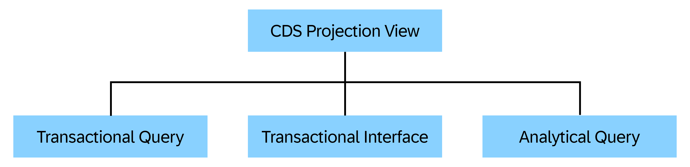
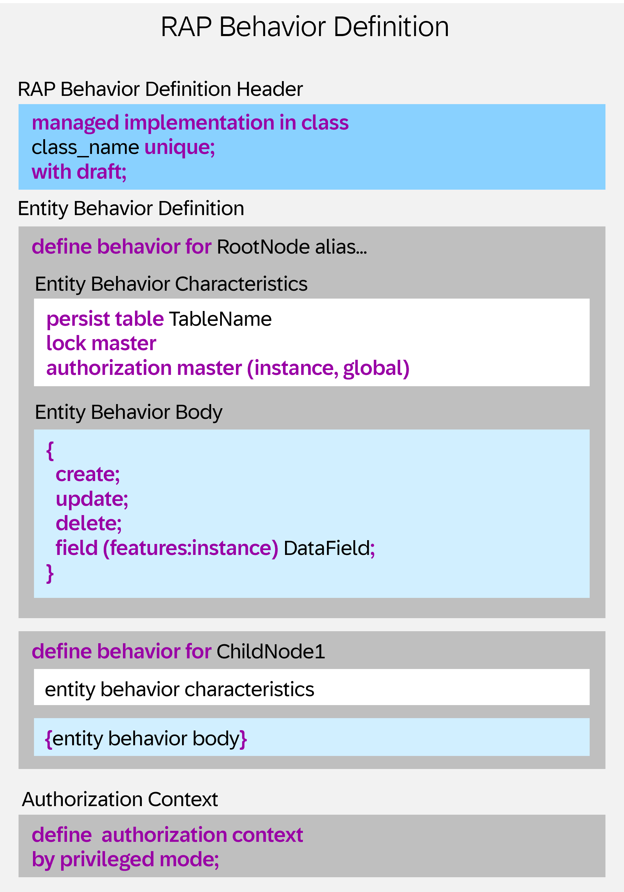
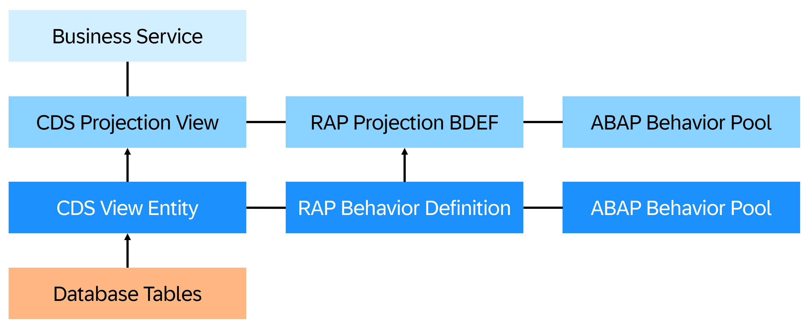

# Core Data Services (CDS) and RAP Modeling

A CDS view is typically created on top of one or more database tables. It selects data from them and defines how data should be read or exposed.
In the ABAP RESTful Application Programming Model (RAP), domain modeling involves defining the structure of business objects (BO) using CDS entities and then defining their behavior. This layer defines the data entities, their attributes, and relationships within the application, ensuring a clear and consistent representation of the business domain. 

For more information on domain modeling in RAP, go to [ABAP RESTful Application Programming Model documentation on ABAP Core Data Services (CDS)](https://www.sap.com/documents/2022/01/96489f20-157e-0010-bca6-c68f7e60039b.html).

## ABAP Core Data Services (CDS)

To define a data model leveraging the ABAP CDS framework, it is essential to generate foundational ABAP repository objects, including the `Data Definition`, `Behavior Definition`, and `Metadata Extension`. These artifacts establish the structural, behavioral, and UI annotation layers of the RAP business object model. These objects have already been generated in a [previous section.](./12-Develop-BTP-ABAP-RAP-Application.md#transactional-ui-services-generation).

### 1. Data Definition

A data definition is a repository object that allows you to define a CDS entity using the CDS [DDL](https://help.sap.com/doc/abapdocu_752_index_htm/7.52/en-US/abencds_f1_ddl_syntax.htm#:~:text=CDS%20data%20definitions%20in%20ABAP,Statements%20for%20CDS%20views) of ABAP CDS in DDL source code.

> **Note**: A CDS entity can be used, for example, as a data source in other CDS entities.

In this tutorial, we focus on `View Entities` and `Projection View Entities`.

#### CDS View Entities

A CDS view entity is a CDS entity defined using the `DEFINE VIEW ENTITY` statement in the CDS DDL of ABAP Core Data Services (CDS). A CDS view entity can be used to select fields from one or more data sources (database tables or other CDS entities). Additional semantic properties can be added using annotations. For more Information, refer to [ABAP CDS - View Entities](https://help.sap.com/doc/abapdocu_latest_index_htm/latest/en-US/index.htm?file=abencds_v2_views.htm).

Let's take a detailed look at one of the view entities:

- [View Entity for Database Table `ZPRA_MF_A_MF`](../src/zpra_mf_service/zpra_mf_r_musicfestival.ddls.asddls)

**CDS view entity structure** - The CDS view entity is structured into three main sections: `Annotations`, `Core Definition`, and `Field Mapping`. Each section plays a distinct role in defining the semantics and structure of your RAP business object.

  - **Annotations** -  A CDS annotation enriches CDS objects with metadata. It can be specified in fixed annotation syntax for specific scopes of a CDS object, namely specific places in a piece of CDS source code. For more details, refer to [ABAP CDS - Annotations](https://help.sap.com/doc/abapdocu_cp_index_htm/CLOUD/en-US/ABENCDS_ANNOTATIONS.html).
        ```abap
        @AccessControl.authorizationCheck: #CHECK
        @Metadata.allowExtensions: true
        @EndUserText.label: '###GENERATED Core Data Service Entity'
        ```

  - **Core definition** - A CDS view entity is a CDS entity, designed primarily to select data from one or more data sources, such as database tables. 
    
    ```abap
    define root view entity ZPRA_MF_R_MusicFestival
      as select from zpra_mf_a_mf as MusicFestival
    ```

  - **Field mapping** - The field mapping section defines which fields are selected from the base data source and how they are exposed in the CDS view.

    ```abap
      title                 as Title,
      description           as Description,
      event_date_time       as EventDateTime,
      max_visitors_number   as MaxVisitorsNumber,
      free_visitor_seats    as FreeVisitorSeats,
      @Semantics.amount.currencyCode : 'VisitorsFeeCurrency'
      visitors_fee_amount   as VisitorsFeeAmount,
      @Consumption.valueHelpDefinition: [ {
        entity.name: 'I_CurrencyStdVH',
        entity.element: 'Currency',
        useForValidation: true
      } ]
      visitors_fee_currency as VisitorsFeeCurrency,
      status                as Status,
      @Semantics.user.createdBy: true
      created_by            as CreatedBy,
      @Semantics.systemDateTime.createdAt: true
      created_at            as CreatedAt,
      @Semantics.systemDateTime.lastChangedAt: true
      last_changed_at       as LastChangedAt,
      @Semantics.user.lastChangedBy: true
      last_changed_by       as LastChangedBy,
      //local ETag field --> OData ETag
      @Semantics.systemDateTime.localInstanceLastChangedAt: true
      local_last_changed_at as LocalLastChangedAt,

      project_id            as project_id,

      //Associations
      _Visits,
      _Status
          
     
    ```

#### CDS Projection Views

A CDS projection view is a special view entity that is based on another view entity. A projection view is usually the top-most layer of a CDS data model, also referred to as consumption layer. A projection view adapts the data model for a service-specific use case.

There are three types of projection views that serve different purposes and are designed for different use cases. Each type has its own feature set and its own syntax checks. The following image gives an overview of the different types of projection views.



**CDS transactional queries**: Used for modeling the projection layer of a business object in RAP.

**CDS transactional interfaces**: Stable public interface, for example, in RAP extensibility scenarios. Usually classified by a release contract to serve as released API.

**CDS analytical queries**: Used for modeling analytical queries within a CDS data model, for example, aggregating data for analytical evaluations.

> **Note** - For more details, refer to [ABAP CDS - Projection Views](https://help.sap.com/doc/abapdocu_cp_index_htm/CLOUD/en-US/ABENCDS_PROJ_VIEWS.html).

Let's take a look at one projection view in detail.

##### Projection View for View Entity `ZPRA_MF_R_MusicFestival`

A projection view for a view entity serves as a layer between the consumer and the business object data model. It’s a key part of exposing business objects in a controlled, secure, and flexible way.
To see how entities are projected, refer to [Projection View for Music festivals](../src/zpra_mf_service/zpra_mf_c_musicfestivaltp.ddls.asddls).

### 2. Behavior Definition

A RAP behavior definition (BDEF) is an ABAP repository object that defines the transactional behavior of a RAP BO in the context of ABAP RAP. The transactional behavior defines and restricts how a RAP BO can be accessed by a RAP BO consumer. A BDEF is always based on a CDS data model that consists of at least one root entity and it refers to the root entity. A root entity can can only have one BDEF.

A RAP behavior definition includes two main components: a header part and at least one entity behavior definition. The entity behavior definition consists of entity characteristics and a body. You can optionally define one or more authorization contexts.



RAP behavior definitions are created using the **RAP BDL** behavior definition language in BDL source code.

The general syntax rules for the RAP BDL are described in the topic [RAP BDL - General Syntax Rules](https://help.sap.com/doc/abapdocu_cp_index_htm/CLOUD/en-US/ABENBDL_GENERAL_SYNTAX_RULES.html).

A list of all available BDL language elements can be found in the topic [RAP BDL - Feature Tables](https://help.sap.com/doc/abapdocu_cp_index_htm/CLOUD/en-US/ABENRAP_FEATURE_TABLE.html).

RAP BDL offers the following statements for different implementation types:

- **managed**
- **unmanaged**
- **interface**
- **projection**
- **abstract**

Let's take a look at one of the behavior definitions in detail.

#### Behavior Definition for View Entity `ZPRA_MF_R_MusicFestival`

The [behavior definition for Music Festival](../src/zpra_mf_service/zpra_mf_r_musicfestival.bdef.asbdef) declares all validations, determinations, action, and attributes required for any application.

**RAP Behavior Definition Structure** -

- **Behavior Definition Header** -
The header can define the following attributes for the entire business object:

  ```abap
  managed implementation in class ZPRA_MF_BP_R_MusicFestival unique;
  strict ( 2 );
  with draft;
  ```

  - `managed implementation in class ZPRA_MF_BP_R_MusicFestival unique` - Specifies that the behavior implementation is managed by the framework, and the custom logic is placed in the specified ABAP class. **Unique** means that each entity instance is uniquely identifiable.
  - `strict ( 2 )` - Enforces **strict syntax checks** according to RAP strict mode version 2, promoting best practices and forward compatibility.
  - `with draft` - Enables **draft handling**, allowing users to edit records in a temporary state before final activation.

- **Entity Behavior Definition** -

  ```abap
    define behavior for ZPRA_MF_R_VISIT alias Visits
    implementation in class ZBP_PRA_MF_R_Visits unique
    persistent table zpra_mf_a_vst
    draft table zpra_mf_d_vst
    lock dependent by _MusicFestival
    authorization dependent by _MusicFestival
    etag master LocalLastChangedAt
    ```

  - `persistent table`: Specifies the database table for active records.
  - `draft table`: Table used to store draft versions of records.
  - `lock dependent by _MusicFestival`: Indicates that the entity’s lock handling depends on the associated parent entity `_MusicFestival`.
  - `authorization dependent by _MusicFestival`: Indicates that the entity’s authorization checks are delegated to the `_MusicFestival` entity.
  - `etag master`: Enables optimistic locking based on the `LocalLastChangedAt` field.

- **Entity Behavior Body** - Consists of the following elements: 
  - `Field Characteristics`
  - `Field Numbering`
  - `RAP BO operations`
  - `validation`
  - `determination`
  - `events`
  - `side effects`
  - `BDEF alternative key`
  - `type mapping`
  - `group`

    ```abap
      update;
      delete ( features : instance );

      field ( numbering : managed )
      Uuid;

      field ( readonly )
      Uuid,
      ParentUuid,
      Status,
      LocalLastChangedAt;

      association _MusicFestival { with draft; }
      association _Visitor;

      determination determineStatus on modify { create; }
      determination determineAvailableSeats on modify { field Status; }

      action ( features : instance ) book result [1] $self;
      action ( features : instance ) cancel result [1] $self;

      side effects
      {
        action book affects field _MusicFestival.( FreeVisitorSeats, Status );
        action cancel affects field _MusicFestival.( FreeVisitorSeats, Status );
      }

      mapping for zpra_mf_a_vst
      {
        Uuid               = uuid;
        ParentUuid         = parent_uuid;
        VisitorUuid        = visitor_uuid;
        ArtistIndicator    = artist_indicator;
        Status             = status;
        LocalLastChangedAt = local_last_changed_at;
      }
    ```

    > **Note**: For more information, refer to [RAP - EntityBehaviorBody](https://help.sap.com/doc/abapdocu_cp_index_htm/CLOUD/en-US/ABENBDL_BODY.html) and [ABAP RAP Behavior Definition](https://help.sap.com/doc/abapdocu_cp_index_htm/CLOUD/en-US/ABENBDL.html).

#### Projection Behavior Definition

A RAP projection BO prepares a business object for a specific business service. The projection enables flexible service consumption and role-based service design. In RAP, a projection BO consists of CDS projection views, RAP projection behavior definitions, and, if needed, additional or consumption-specific implementations.

The following image shows the role of RAP projection behavior definitions for a business service.



#### Projection Behavior Definition for `ZPRA_MF_C_MusicFestivalTP`

Go to [Projection Behavior for Music Fest](../src/zpra_mf_service/zpra_mf_c_musicfestivaltp.bdef.asbdef).
It is described here how actions and associations are defined.

> **Note** - For more information about projection behavior definitions, refer to [RAP - Projection Behavior Definitions](https://help.sap.com/doc/abapdocu_cp_index_htm/CLOUD/en-US/ABENBDL_PROJECTION_BO.html).

### 3. Metadata Extension

In SAP BTP ABAP RESTful Application Programming Model, a metadata extension is a way to annotate CDS views externally, providing UI-related annotations without modifying the original CDS view itself. This is particularly useful when you want to enrich the UI presentation layer, for example, how fields are shown in SAP Fiori elements applications without touching the base CDS artifacts. This maintains separation of concerns and enhances reusability. For a reference of a sample application, see [Enhance the Business Object Data Model and Enable OData Streams](https://developers.sap.com/tutorials/abap-environment-rap100-enhance-data-model.html?utm_source=chatgpt.com).


A CDS metadata extension is a CDS object that is defined and transported in a separate piece of DDLX source code. These pieces of DDLX source code can only be edited in ADT.

Alongside the CDS DDL statements for data definitions, there is a CDS DDL statement for defining metadata extensions in DDLX source code. To extend a CDS entity with metadata extensions, you need to specify the annotation **@Metadata.allowExtensions** in the DDL source code of the CDS entity. The default value for this annotation is *true*.

Below is the basic implementation of the metadata extension for `ZPRA_MF_C_MusicFestivalTP`. If you want to enhance this metadata extension for a specific use case, refer to [ABAP CDS DDL - ANNOTATE ENTITY, VIEW](https://help.sap.com/doc/abapdocu_cp_index_htm/CLOUD/en-US/ABENCDS_F1_ANNOTATE_VIEW.html). 

For more information, refer to [Metadata Extension for Music Festival](../src/zpra_mf_service/zpra_mf_c_musicfestivaltp.ddlx.asddlxs).

## Associations

Associations are fundamental for defining relationships between different business object entities. They allow you to model how entities are connected, navigate between them, and perform operations on related data. They are exposed in projection views to be consumable by OData services. Properly defined associations are crucial for building robust and meaningful OData services.

### Association Types

In the context of RAP, associations can be categorized into three main types:

- **Standard Association**:
  - This defines a general relationship between two entities. The lifecycle of the associated entities can be independent. For example, a music festival event can have many visitors. A visitor is referenced in an event. If an event is cancelled, visitors still exist independently of that event. Only the reference is removed.
  - They are defined in CDS views using the 'association' keyword. Cardinality, for example to-one ([1], [0..1]) or to-many ([*], [0..*], [1..*]) specifies the nature of the relationship.

- **Composition**:
  - This represents a stronger, whole-part relationship where the existence of the child (part) entity depends on the parent (whole) entity. If the parent is deleted, its compositions (children) are typically deleted as well. For example: A music festival event consists of multiple visits, which serve as a bridge between the event and its visitors. A visit represents a specific instance of a visitor attending an event and cannot exist independently without the associated event.
  - They are defined in CDS views using the 'composition' keyword. Cardinality, for example to-one ([1], [0..1]) or to-many ([*], [0..*], [1..*]) specifies the nature of the relationship.
  - They are essential for managing transactional consistency and lifecycle dependencies.

- **Cross-Business-Object Association (External Association)**:
  - These associations link entities from different RAP BOs. This is useful when you need to relate data across separate transactional boundaries or microservices.
  - They require careful consideration of consistency and transactional behavior.

While creating applications, we often model these relationships to build intuitive and powerful services. For instance:

- **Composition** is established between the **Music Festival Event** and **Visit** entities, signifying a strong lifecycle dependency. This means that **visits are integral part of an event** — they are created, updated, and deleted together with the event. A visit cannot exist without its parent event. The use of composition enforces this tight coupling and ensures consistency in lifecycle management.

- **Association** is defined between the **Visit** and **Visitor** entities, representing a weaker relationship. While a **visit may be linked to a visitor**, the **visitor exists independently** of any visit. This standard association allows for navigational access from a visit to its corresponding visitor without enforcing lifecycle dependency. It reflects a more flexible relationship, where visitors can participate in multiple events over time and are not bound to the existence of any specific visit.

For more information on how associations are defined, see [Association Definition for Music Festival](../src/zpra_mf_service/zpra_mf_r_musicfestival.ddls.asddls).

The current application needs to have an association between two entities:

  1. Music Festival
  2. Visitors
  
To define the association, you need to define the association in the View entity for music festivals. The below code snippet defines how the **Visit** table created can be used to link between a music festival and visitors.

``` abap
  define root view entity ZPRA_MF_R_MusicFestival
    as select from zpra_mf_a_mf as MusicFestival
    composition [0..*] of ZPRA_MF_R_VISIT                   as _Visits
    association [1..1] to ZPRA_MF_I_Music_Fest_Status_VH as _Status on $projection.Status = _Status.Value
```

You also need to define the respective associations under the view entity:

```abap
 //Associations
      _Visits,
      _Status
```

This enables the association from the **Music Festival** entity. 
You can now create the association from **Visits** and **Visitor** entities similarly to establish the connection.

For the **Visit** entity in the `ZPRA_MF_R_VISIT` view entity, the following association can be created:

```abap
define view entity ZPRA_MF_R_VISIT
  as select from zpra_mf_a_vst
  association        to parent ZPRA_MF_R_MusicFestival as _MusicFestival on $projection.ParentUuid = _MusicFestival.Uuid
  association [0..1] to ZPRA_MF_R_Visitor                 as _Visitor          on $projection.VisitorUuid = _Visitor.Uuid
  association [1..1] to ZPRA_MF_I_Visitor                 as _VisitorVH        on $projection.VisitorUuid = _VisitorVH.VisitorId
  association [1..1] to ZPRA_MF_I_Visit_Status_VH         as _Status           on $projection.Status = _Status.Value
```

For **Visitors** entity in the `ZPRA_MF_R_Visitor` view entity, the following association can be created:

``` abap
define root view entity ZPRA_MF_R_Visitor
  as select from zpra_mf_a_vstr as Visitor
  association [1..*] to ZPRA_MF_R_VISIT as _Visits on $projection.Uuid = _Visits.VisitorUuid
```

The above created associations can help in establishing the relation between entities.

### More Information

- [Associations ABAP EML](https://help.sap.com/doc/abapdocu_cp_index_htm/CLOUD/en-US/ABENCDS_SIMPLE_ASSOCIATION_V2.html)
- [Compositions ABAP EML](https://help.sap.com/doc/abapdocu_cp_index_htm/CLOUD/en-US/ABENCDS_COMPOSITION_V1.html)
