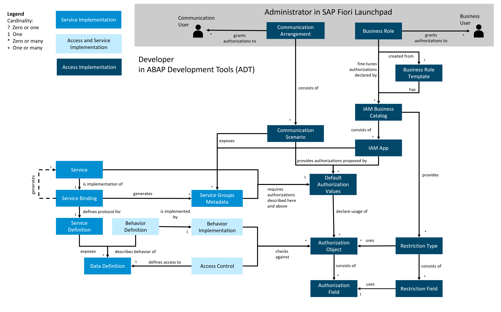
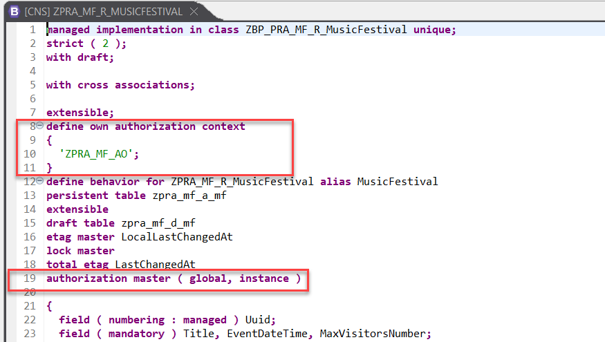
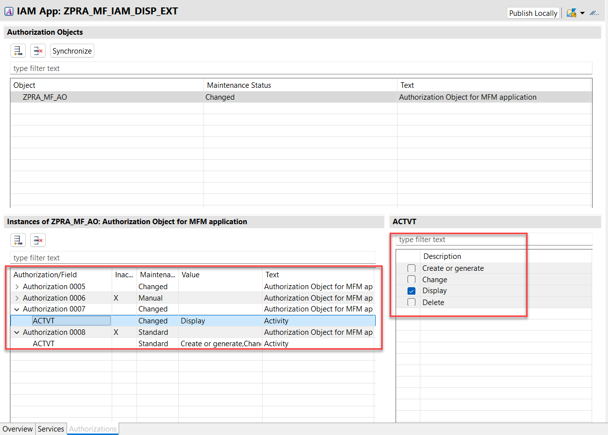

# Add Authentication and Role-Based Authorization

This section explains the different roles and authorization concepts that must be implemented in the ABAP RESTful Application Programming (RAP) Partner Reference Application. The final aim here is to have two different role templates for the two personas as depicted in the table below.

---
| Persona   | Role Template Id | Description |
| :-------: | :-------: | :----------- |
| Manager | ZPRA_MF_UPD_BRT | The Manager is able to perform CRUD operations in both the applications (Manage Music Festivals and Manage Visitors). |
| Visitor | ZPRA_MF_DISP_BRT | The Visitor only has display access for both the apps (Manage Music Festivals and Manage Visitors). |
---

The below image gives a [quick overview](https://help.sap.com/docs/btp/sap-business-technology-platform/authorization-basics?version=Cloud) and relation between the objects that need to be created for the authorization concepts for the PRA RAP application. 

  

## Creating Authorization Objects

[Authorization Objects](https://help.sap.com/docs/abap-cloud/abap-development-tools-user-guide/defining-authorization-objects) in ABAP define user permissions, controlling access to functions in ABAP RAP applications on SAP BTP. They ensure security by checking users' rights for specific tasks. 

1. On ABAP Development Tools for Eclipse, right-click on **ABAP Package – ZPRA_MF_SERVICE -> New -> Other ABAP Repository Object** and create a new authorization object named **ZPRA_MF_AO**.
2. Set the authorization field to *ACTVT* with permitted activities – **‘01’(Create or generate)**, **‘02’ (Change)**, **‘03’ (Display)** and **‘06’ (Delete)**.
3. Save the changes in a workbench transport request.
---

## Introducing the Authorization Object in the BDEF 

To protect your service from activities such as create, update, or delete by unauthorized users, you can use the authorization controls that are available for services based on managed business objects.

1. In ABAP development tools, call up the behavior definition of the services.
2. In the behavior definition, define authorization controls for both the services.

  

 For more information on BDEFs, see - [zpra_mf_r_musicfestival](../src/zpra_mf_service/zpra_mf_r_musicfestival.bdef.asbdef) and [zpra_mf_r_visitor](../src/zpra_mf_service/zpra_mf_r_visitor.bdef.asbdef).

3. With the **authorization master ( global, instance )** line, an authorization check for the standard operations create, update, delete, and for non-standard operations is defined. Implement the authorization check using a method with addition **FOR GLOBAL AUTHORIZATION** and **FOR INSTANCE AUTHORIZATION** in the [behavior implementation](https://help.sap.com/docs/ABAP_PLATFORM_NEW/fc4c71aa50014fd1b43721701471913d/b915e9d784734ec088ac2cb51a0c18e6.html?locale=en-US&state=PRODUCTION&version=202310.003).

Refer to the sample code in the **get_global_authorizations** method using [this link](../src/zpra_mf_service/zbp_pra_mf_r_musicfestival.clas.locals_imp.abap).

Refer to the sample code in the **get_instance_authorizations** method using [this link](../src/zpra_mf_service/zbp_pra_mf_r_musicfestival.clas.locals_imp.abap).

---
## Editing Authorization Default Values

Authorization default values are automatically created when creating service bindings. You can add authorization objects and change the default authorization values.

1. Open the service binding and choose **Maintain Authorization Default Values**.
2. Choose **Retrieve** to add the latest authorization objects from the own context.
3. To check or change the authorization default values that are assigned automatically, select the authorization objects in the list.
You can now specify what activities you want to authorize.
4. Select the authorization object from the list and choose **Default With Field Values** from the dropdown list. In this example, you need to authorize the standard activities - Create, Display, Change and Delete.
--- 
## Creating Access Controls

[Access controls](https://help.sap.com/docs/abap-cloud/abap-development-tools-user-guide/access-controls?version=sap_btp&locale=en-US) ensure that only authorized users access specific system data and functions, protecting information and maintaining security.

1. Create an access control object for the root CDS views **ZPRA_MF_R_MUSICFESTIVAL** and **ZPRA_MF_R_VISITOR**. This restricts access to data using the **ZPRA_MF_AO** authorization object for display/read access ('ACTVT' EQ '03').
2. Create an access control object for the consumption views **ZPRA_MF_C_MUSICFESTIVALTP** and **ZPRA_MF_C_VISITORTP**.

## Defining IAM Apps for the Business Service

An [identity and access management (IAM) app](https://help.sap.com/docs/abap-cloud/abap-development-tools-user-guide/creating-app) grants access to a set of services and authorizations.

* To assign a business user to a business role for the service, you need to create an IAM app. You can then include this app in a business catalog. Finally, assign the catalog to a business role.
* Since you want to make your service available to users with a certain business role, you need to define an IAM app for the service that is created. The IAM app is only relevant for identity and access management, and is created in ABAP Development Tools for Eclipse.
* In this case, you need three IAM apps as listed below. Two IAM apps are for each of the applications - Music Festival Manager and Visitors. The third IAM app is needed to enable the change access to both the applications. 
    * **ZPRA_MF_IAM_DISP_EXT** – This IAM app object enables display access and holds the SAP Fiori launchpad App Descr Item ID - **ZPRA_MF_MF_UI5R** for the Music Festival app.

      

      Additionally, you need to ensure that only **Display (03)** access is set.

    * **ZPRA_MF_VISIT_DISP_EXT** – Similar to the previous one, this IAM app object enables display access and holds the SAP Fiori launchpad App Descr Item ID - **ZPRA_MF_VSTR_UI5R** for the Visitors app.

      Additionally, you need to ensure that only **Display (03) access** is set.

    * **ZPRA_MF_IAM_UPD_EXT** – This is an additional IAM app object that enables the **Write** access to both the applications - **Music Festival Manager and Visitors**.
      Add both the services in this IAM app object. No changes are required at the authorization levels.

---
## Creating Business Catalogs

[Business catalogs](https://help.sap.com/docs/abap-cloud/abap-development-tools-user-guide/creating-business-catalog) grant access to an app, a set of apps, or individual aspects of an app.

* You now have to create the following business catalogs and assign the IAM apps created in the previous step to it.
---------------------------------------------
| Business Catalog | Description | IAM App(s) to be Assigned | 
| :-------: | :-------: | :-------: | 
| ZPRA_MF_BC_DISP | Business Catalog for Display Access | ZPRA_MF_IAM_DISP_EXT, ZPRA_MF_VISIT_DISP_EXT | 
| ZPRA_MF_BC_UPD | Business Catalog for Change Access | ZPRA_MF_IAM_DISP_EXT, ZPRA_MF_VISIT_DISP_EXT, ZPRA_MF_IAM_UPD_EXT |
---

* Save the business catalogs and publish them locally.

## Creating Business Role Templates

A [business role template](https://help.sap.com/docs/abap-cloud/abap-development-tools-user-guide/creating-business-role-template) is a predefined set of authorizations and assigned business catalogs that you can use as a basis for creating new business roles.

* In addition to the business catalogs, you also have to create business role templates as listed in the table below. 
---------------------------------------------
| Business Role Template | Description | Business Catalog(s) to be Assigned |
| :-------: | :-------: | :-------: | 
| ZPRA_MF_DISP_BRT | Business Role Template for Display Access | ZPRA_MF_BC_DISP |
| ZPRA_MF_UPD_BRT | Business Role Template for Change Access | ZPRA_MF_BC_UPD |
---

* Choose **Publish Locally** to make the business role templates available to assign them to the relevant business users.
---
