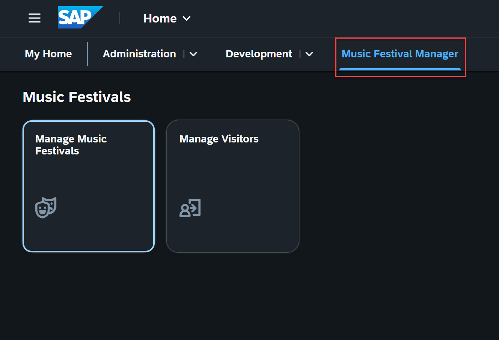

# Integrating Your SAP Fiori Application into the Launchpad

This section explains how to use identity and access management (IAM) apps and business catalogs to define and manage business roles in the system. It also covers how to configure launchpad spaces and assign them to the appropriate business roles. This ensures users have access to the right applications. 

## Assigning Launchpad App Descriptor Id in IAM Apps

1. Open ADT, select your **ZPRA_MF_SERVICE** package and open your **ZPRA_MF_IAM_DISP_EXT** IAM app. 

2. Add the UI5 application ID (Launchpad App Descr Id) generated during deployment to your IAM app and activate it. 

3. Maintain the same information for your **ZPRA_MF_VISIT_DISP_EXT** IAM app.

4. Publish your IAM apps.
---

For a detailed instruction on how to create the objects listed below, refer to the tutorial - [Create SAP Fiori Launchpad Space and Page Templates](https://developers.sap.com/tutorials/abap-environment-create-spaces-pages-template..html). 

* Launchpad page template 
* Launchpad space template
* Scope page and space templates
* Business role template - Launchpad space template assignment
* Business role and assignment to business users

## Creating a Launchpad Page Template 
[Launchpad page templates](https://help.sap.com/docs/abap-cloud/abap-development-tools-user-guide/working-with-page-templates-uipg?version=sap_btp) simplify the configuration process of the SAP Fiori launchpad by providing predefined layouts.

1. Create a launchpad page template named **ZPRA_MF_LPT** in the **ZPRA_MF_UI_MNG_MUSIC_FESTS** package.
   For detailed instructions, refer to [Creating Launchpad Page Templates](https://help.sap.com/docs/abap-cloud/abap-development-tools-user-guide/creating-page-templates?version=sap_btp&locale=en-US).
2. In the **Launchpad Page Template Editor**, create two new visualizations named **ZPRA_MF_SECTION_MF_VIZ** and **ZPRA_MF_SECTION_VSTR_VIZ** for the applications **Manage Music Festivals** and **Manage Visitors** respectively and assign the respective Launchpad App Descriptor Items.
   For detailed instructions, refer to [Editing Launchpad Page Templates](https://help.sap.com/docs/abap-cloud/abap-development-tools-user-guide/editing-page-templates?version=sap_btp&locale=en-US).

## Creating a Launchpad Space Template 
[Launchpad space templates](https://help.sap.com/docs/abap-cloud/abap-development-tools-user-guide/working-with-space-templates-uist?version=sap_btp) simplify the configuration process of the SAP Fiori launchpad by providing predefined layouts.

1. Create a launchpad space template named **ZPRA_MF_LST** in the **ZPRA_MF_UI_MNG_MUSIC_FESTS** package.
   For detailed instructions, refer to [Creating Launchpad Space Templates](https://help.sap.com/docs/abap-cloud/abap-development-tools-user-guide/creating-space-templates?version=sap_btp&locale=en-US).
2. In the **Launchpad Space Template Editor**, update the **Sort Priority** and add the launchpad page template named **ZPRA_MF_LPT**.
   For detailed instructions, refer to [Editing Launchpad Space Templates](https://help.sap.com/docs/abap-cloud/abap-development-tools-user-guide/editing-space-templates?version=sap_btp&locale=en-US).

## Scoping Page and Space Templates
The [scoping of space and page templates](https://help.sap.com/docs/sap-btp-abap-environment/abap-environment/scoping-space-and-page-templates?locale=en-US) refers to the process of defining the visibility or accessibility of these objects.

* Create an ABAP class named **ZCL_PRA_MF_SCOPE_PG_SP_TMPLT** to implement your own scoping using the **CL_APS_BC_SCOPE_CHANGE_API** scoping API.
* Update the names of the launchpad page template **ZPRA_MF_LPT** and launchpad space template **ZPRA_MF_LST** in the code. 
* Check the reference code [here](../src/zpra_mf_ui_mng_music_fests/zcl_pra_mf_scope_pg_sp_tmplt.clas.abap).

## Creating a Business Role Template and Assigning the Launchpad Space Template

> Note: Creating business role templates was already explained in [this tutorial](./21-AuthorizationObject-IAM-Roles.md).

* Assign the launchpad space templates to the business role templates as listed in the table below. 
---------------------------------------------
| Object Name | Business Role Template | Launchpad Space Template |
| :-------: | :-------: | :-------: | 
| ZPRA_MF_DISP_BRT_SPT | ZPRA_MF_DISP_BRT | ZPRA_MF_LST |
| ZPRA_MF_UPD_BRT_SPT | ZPRA_MF_UPD_BRT | ZPRA_MF_LST |
---

## Creating Business Roles and Assigning Business Users
A business role is the administrative object that administrators use to group and fine-tune authorizations and assign them to business users. To create a business role, an administrator adds one or multiple IAM business catalogs to it.

1. Log on to SAP Fiori launchpad as **Administrator** and open the **Maintain Business Roles** app.
2. Choose **Create From Template**.
3. Create a new role named **ZPRA_MF_UPD_BR**. As template name, select **ZPRA_MF_UPD_BRT**. Don't change the other values. Choose **OK**.
4. Choose **Maintain Restrictions**. Set the **Write, Read, Value Help** access category to **Unrestricted**. Navigate back to the details screen.
5. On the **Business Users** tab, assign the relevant business users.
6. Choose **Save**.
7. Next, create a new role named **ZPRA_MF_DISP_BR**. As template, select **ZPRA_MF_DISP_BRT**.
8. Adjust the restrictions like you did for the previous role.
9. Assign the relevant business users like you did for the previous role.
10. Both apps are now visible under the **Music Festival Manager** section.

