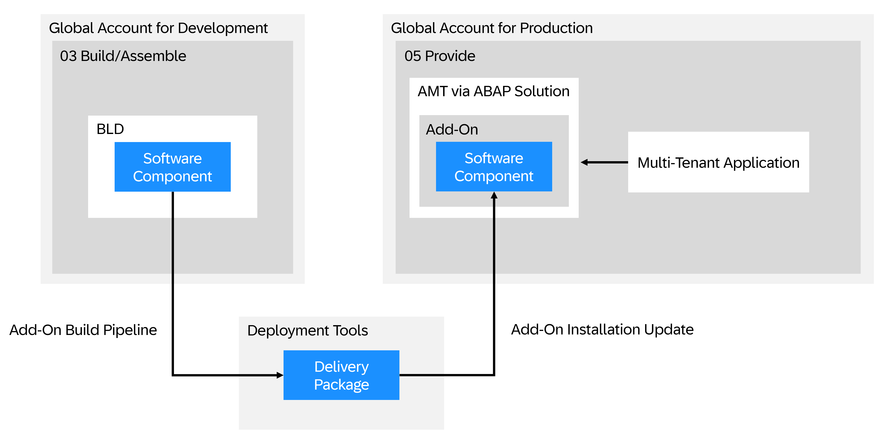
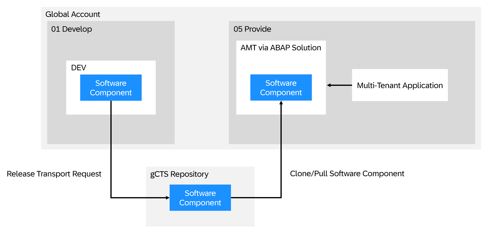

# Multitenancy - How to Build, Deploy, and Provision the Application

Now that you have [developed](./11-Prepare-BTP-Account-ADT-For-Dev.md) and tested the **Music Festival Manager** application, you are ready to deploy it as a multi-tenant application on SAP BTP in the ABAP environment. Multitenancy refers to the ability to host multiple customers, known as tenants, on a single shared computing infrastructure. This approach optimizes administration and significantly reduces total cost of ownership (TCO).

Multitenancy in the ABAP environment enables application providers to develop and operate ABAP solutions as software as a service (SaaS), leveraging SAP BTP infrastructure. While the actual runtime of the application resides in the provider account, the subscriber accounts are used for the tenant-specific configuration, such as destinations or authorization and authentication.

> **💡 Recommended Readings**
>
> - SAP Help Portal provides a comprehensive overview of [SaaS Applications and Multitenancy](https://help.sap.com/docs/btp/sap-business-technology-platform/multitenancy-and-saas-applications?locale=en-US&version=Cloud) in the ABAP environment. The following sections in this tutorial will summarize the main steps and information provided in the documentation. However, it is recommended to read the [linked documentation](https://help.sap.com/docs/btp/sap-business-technology-platform/multitenancy-and-saas-applications?locale=en-US&version=Cloud) to get a complete understanding of the concepts and capabilities.
> - To learn more about multitenancy in the ABAP environment, the multi-tenant application, tenant business types, and lifecycle, see the multitenancy development guidelines [Multitenancy in the ABAP Environment](https://help.sap.com/docs/sap-btp-abap-environment/abap-environment/multitenancy-and-saas-applications?version=Cloud).

## Subaccounts, Entitlements, and Services

As a SaaS application, you have to configure the global account for development, and entitle the required services in the corresponding subaccounts. For more information, see [Set Up a Global Account for Development](https://help.sap.com/docs/btp/sap-business-technology-platform/prepare?locale=en-US&version=Cloud#set-up-a-global-account-for-development).

## Delivery Options - `Add-On Delivery` or `gCTS-Transport-Based Delivery`

You have two options to deliver your software components:

1. Using add-on products as a means to deliver software components by installing or updating delivery packages in a system.
2. Using the gCTS-transport-based import of software components.

For more information and recommendations for the different use cases, see [Delivery via Add-On or gCTS](https://help.sap.com/docs/btp/sap-business-technology-platform/delivery-via-add-on-or-gcts?locale=en-US&version=Cloud). It is possible to start out with gCTS transport delivery in the prototyping phase of a project and establish an add-on build delivery approach once the initial version needs to be delivered and customer systems need to be created.

Depending on the delivery option you choose, you can follow the steps below:

### Delivery Using Add-On

#### Build

This step is required to build the add-on product that contains the **Music Festival Manager** application.

> Ensure that you have the required entitlements in the 03 Build/Assemble and 04 Build/Test subaccounts as described in [Set Up a Global Account for Development](https://help.sap.com/docs/btp/sap-business-technology-platform/prepare?locale=en-US#set-up-a-global-account-for-development).
>
> Note: For `hana_compute_unit`, you need to entitle a minimum quantity of 2.

Follow the [build](https://help.sap.com/docs/btp/sap-business-technology-platform/build?locale=en-US&version=Cloud) documentation to configure and execute an add-on build pipeline. A successful build pipeline execution results in a new product version that can be installed.

#### Deploy

Deploy and offer your product as a SaaS solution. This allows customers to access the add-on through a subscription in the SAP BTP cockpit.

> Ensure that you have the required entitlements in the 05 Provide subaccount as described in [Set Up a Global Account for Development](https://help.sap.com/docs/btp/sap-business-technology-platform/prepare?locale=en-US#set-up-a-global-account-for-development).
>
> Note: For `hana_compute_unit`, you need to entitle a minimum quantity of 2.

Follow the [deploy](https://help.sap.com/docs/btp/sap-business-technology-platform/saas-apps-order-and-provide?locale=en-US&version=Cloud#deploy) documentation to deploy your solution. You have the following options:

##### 1. Using the Maintain Solution App in the Landscape Portal

For your add-on based delivery, after completing the steps in the build section, you can proceed with the steps in the [corresponding section of the deploy documentation](https://help.sap.com/docs/btp/sap-business-technology-platform/saas-apps-order-and-provide?locale=en-US#loioa44d1c7dcbf7460e9f4d4ac964dc841f).

##### 2. Configure a Solution Manually

You can use this option if you want to finetune your solution beyond the options offered in the **Maintain Solution** app.

> **Note**:
>
> You can find a reference solution at [sap-software/abap-saas-reference-solution on github.com](https://github.com/sap-software/abap-saas-reference-solution).
> You can also initially configure your solution using the **Maintain Solution** app and then use the download functionality to obtain the application descriptor file.

For more information, see the [Configure a Solution Manually](https://help.sap.com/docs/btp/sap-business-technology-platform/saas-apps-order-and-provide?locale=en-US#loioa4c7b148a9ab4341b876574fd54c0a18) section in the deploy documentation.

### Delivery Using gCTS Transport

For gCTS transport-based delivery, there's no need to build an add-on product. You can directly deploy and offer your product as a SaaS solution. This allows customers to consume the add-on through a subscription in the SAP BTP cockpit.

> Ensure that you have the required entitlements in the 05 Provide subaccount as described in [Set Up a Global Account for Development](https://help.sap.com/docs/btp/sap-business-technology-platform/prepare?locale=en-US#set-up-a-global-account-for-development).
>
> Note: For `hana_compute_unit`, you need to entitle a minimum quantity of 2.

You have to configure the solution manually, as the **Maintain Solution** app currently doesn't support gCTS based delivery. You can use the [Configure a Solution Manually](https://help.sap.com/docs/btp/sap-business-technology-platform/saas-apps-order-and-provide?locale=en-US#loioa4c7b148a9ab4341b876574fd54c0a18) section in the deploy documentation to configure and deploy your solution.

For the **Music Festival Manager** application, you can also have a look at the sample deployment and instructions available in the [deploy](../deploy) folder of this repository.

> For more information, see the [Deploy](https://help.sap.com/docs/btp/sap-business-technology-platform/saas-apps-order-and-provide?locale=en-US&version=Cloud#deploy) documentation on SAP Help Portal.

## Subscribe

Once the SaaS solution has been deployed using one of the two options, you as a SaaS solution operator are responsible for onboarding the customer. You can test the provisioning of the SaaS solution in your global account for development by creating consumer subaccounts (`06 Consumer` in [Set Up a Global Account for Development](https://help.sap.com/docs/btp/sap-business-technology-platform/prepare?locale=en-US#set-up-a-global-account-for-development)).

Follow the [subscribe](https://help.sap.com/docs/btp/sap-business-technology-platform/saas-apps-order-and-provide?locale=en-US#subscribe) documentation to:

1. Create a consumer subaccount for the customer.
2. Subscribe to the SaaS solution in the consumer subaccount.
3. Configure the consumer subaccount to use the SaaS solution.
4. Onboard the initial user.

> **gCTS Transport-Based Delivery**
>
> When delivering using gCTS, you as a SaaS solution operator can use a separate test subscription that is not related to a customer to trigger the creation of the system before the actual customer subscription. Then, you can import the required software components into the system using the **Manage Software Components** app in the ABAP system client (100). The imported software components can then be used in the consumer subaccounts.

## Commercialize

To offer your SaaS solution to customers, you can optionally register it in the SAP Store.

See the documentation on [commercializing](https://help.sap.com/docs/btp/sap-business-technology-platform/saas-apps-order-and-provide?locale=en-US&version=Cloud#commercialize) to learn more about registration to SAP Store and the SAP Extension Suite certification.
