# Integrate the SAP BTP Application with SAP S/4HANA Cloud Public Edition

- [Introduction](#introduction)
- [Consume SAP S/4HANA Cloud Public Edition OData APIs](#consume-sap-s4hana-cloud-public-edition-odata-apis)
- [Outbound Communication Setup in SAP BTP Application](#outbound-communication-setup-in-sap-btp-application)
- [Inbound Communication Setup in SAP S/4HANA Cloud Public Edition](#inbound-communication-setup-in-sap-s4hana-cloud-public-edition)
- [Enhance the Business Logic to Operate on SAP S/4HANA Cloud Public Edition Data](#enhance-the-business-logic-to-operate-on-sap-s4hana-cloud-public-edition-data)
- [Enhance the Web App to Display SAP S/4HANA Cloud Public Edition Data](#enhance-the-web-app-to-display-sap-s4hana-cloud-public-edition-data)

## Introduction

### Front-End Integration
---
> Disclaimer: When selecting the ProjectID, which is hyperlinked to the URL of the enterprise project created in the SAP S/4HANA Cloud Public Edition system, you're prompted to enter your credentials and log in.

This section guides you through the navigation from SAP BTP ABAP environment Partner Reference Application to the enterprise project created in the SAP S/4HANA Cloud Public Edition system.
 
#### Configuring Trust Using SAML 2.0

Set up the trust relationship between the SAP BTP subaccount and the Identity Authentication service using SAML 2.0. For more information, refer to [SAP Cloud Identity Services](https://help.sap.com/docs/identity-authentication/identity-authentication/saml-2-0). The SAML2 usage applies only if the OpenID Connect configuration isn't possible. This occurs when the SAP BTP subscriber subaccount and the Identity Authentication service tenant aren't assigned to the same customer ID. This setup comes with limitations regarding remote access to the OData services of the SAP BTP application with principal propagation.

1. In the SAP BTP consumer subaccount, download the **SAML** metadata file of the subaccount.
    1. Open **Security** in the menu and go to **Trust Configuration**.
    2. Choose **Download SAML Metadata**.

2. On the Identity Authentication admin UI, go to **Applications and Resources > Applications** and create a new application of the type *SAP BTP Solution*.
    1. Enter the required information, such as application display name, home URL, and so on. 
    The display name appears on the user login screen. The login applies to all applications linked to the Identity Authentication service tenant, following the single sign-on principle.
    2. Go to **SAML 2.0 Configuration** and upload the **SAML** metadata file from the SAP BTP subaccount you've downloaded in the previous step.
    3. As **Subject Name Identifier**, select *E-Mail* as the primary attribute.
    4. As **Default Name ID Format**, select *E-Mail*.
    5. Go to **Attributes** and add the **Groups** user attribute with the **Groups** value from the **Identity Directory** source.
        > Note: The **Groups** assertion attribute is used to process authorization checks in the consumer subaccount based on user groups. The **Groups** value of the assertion attribute must be written with a **capital G** for SAP BTP subaccounts.

3. To download the **SAML** metadata file of the IdP, go to **Applications and Resources > Tenant Settings > SAML 2.0 Configuration** and choose *Download Metadata File*.

4. In the SAP BTP consumer subaccount, go to **Security > Trust Configuration**. 
    1. Choose **New SAML Trust Configuration**. 
    2. Upload the **SAML** metadata file of the IdP that you've just downloaded and enter a meaningful name and description for the IdP, for example ``Corporate IdP``.

Looking for more information on the SAP Authorization and Trust Management service? Go to [Building Side-By-Side Extensions Using SAP BTP](https://learning.sap.com/learning-journeys/build-side-by-side-extensions-on-sap-btp/describing-authorization-and-trust-management-xsuaa-_cbf0d0c5-29ec-4685-9cf4-487156b41284).

#### Details
1. Define a **Nav** field of type abap.char(120) that holds the target URL in the **ZPRA_MF_AE_REMOTE_PROJ** custom entity. This is created for displaying the project information facet in the object Page of the **Manage Music Festival** application. This process is explained in the [Enhance the Web App to Display SAP S/4HANA Cloud Public Edition Data](#enhance-the-web-app-to-display-sap-s4hana-cloud-public-edition-data) section below.
2. Annotate the **Nav** field with **@UI.hidden: true**.
3. The **Nav** field has to be populated in the **ZCL_PRA_MF_FETCH_PROJ** implementation class.
  * Inside the **if_rap_query_provider~select** method, fetch the hostname maintained in the communication arrangement created for the **ZPRA_CS_ENT_PROJ** scenario.
  * Prepare the complete URL by concatenating the hostname fetched above with the service URL for the enterprise project along with the **Project ID**. 
  * You can have a look at the [reference code](../src/zpra_mf_service/zcl_pra_mf_fetch_proj.clas.abap).
5. Annotate the **ProjectID** key field with **#WITH_URL**. You can have a look at the [reference code](../src/zpra_mf_service/zpra_mf_ae_remote_proj.ddls.asddls).

### Back-Channel Integration

This section describes how to create an enterprise project in an SAP S/4HANA Cloud Public Edition system from the SAP BTP ABAP environment. To achieve integration, configure outbound communication from SAP BTP and inbound communication in SAP S/4HANA Cloud Public Edition. Use HTTP-based basic authentication for secure data exchange between the systems.

#### Consume SAP S/4HANA Cloud Public Edition OData APIs
You need to import the SAP S/4HANA Cloud Public Edition OData service as a *remote service* into the SAP BTP ABAP environment. Additionally, you have to use the OData service to create SAP S/4HANA Cloud Public Edition enterprise projects to plan and run music festival.

You keep the core of your multi-tenant application, which you developed in the previous tutorials, and implement changes for the ERP integration.

> Note: Your solution is now ready to save a version of your implementation in your version control system. This enables you to return to the multi-tenant application without ERP integration at any time.

##### Import SAP S/4HANA Cloud Public Edition OData Services

1. ##### Download the metadata files (.edmx files) from the API specification section for [Enterprise Project (OData v2)](https://api.sap.com/api/API_ENTERPRISE_PROJECT_SRV_0002/overview).

2.	##### Set up a service consumption model.
   
In the SAP BTP ABAP environment, set up a service consumption model that imports an .edmx file to define and interact with external OData services. The process generates two classes essential for integration. One class has the same name as the service consumption model. The other one is named **SERVICE_CONSUMPTION_MODEL_NAME_SRV**.

   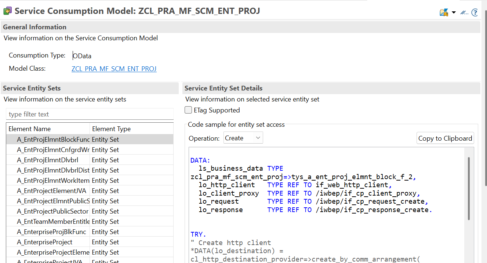

3.	##### Create an outbound service with the **HTTP Service** service type.

       

#### Outbound Communication Setup in SAP BTP Application
   
1.	##### Create a communication scenario.
    1. In the **General** section, enter the following values:
      
       **Communication Scenario Type**: Customer Managed

       **Allowed Instances**: One Instance per client
    3.	In the **Outbound** section, choose **Add** to add the outbound service you've just created.
    4.	Save and ativate your changes.

       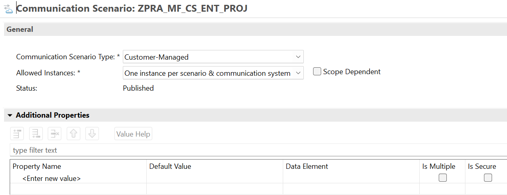
       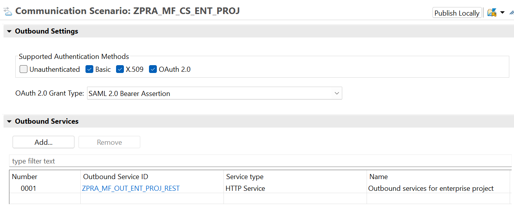
       
2.	##### Use the **Maintain Communication User** application to create a new communication user.
    Enter a user name, description, and password. Choose **Save**.

       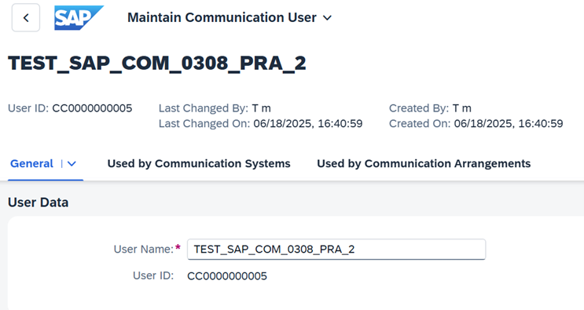
    
3.	##### Create a communication system using the **Communication Systems** application.
    1.	Enter a system ID and system name of your choice and choose **Create**.
    2.	Under **Technical Data**, enter a destination system as host name. For example: ***.sap.
       > Note: Don't include https://.
    3.	Add a user for outbound communication. 
        1.	Choose the plus icon.
        2. 	As **Authentication Method**, set *User Name and Password*.
        3. 	As **User name/Client ID**, set the [communication user](#use-the-maintain-communication-user-application-to-create-a-new-communication-user) you've created.
        4.	As **Password**, enter the password of the communication user.
        5.	Choose **Create**.

       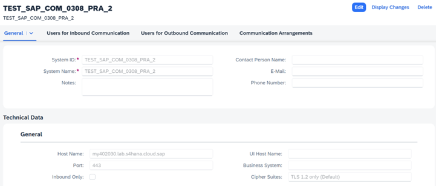
       
      
 4.	##### Create the communication arrangement for the communication scenario.
    1.	Open the **Communication Arrangements** application and choose **New**.
        1.	Select the [communication scenario](#create-a-communication-scenario) you've created.
        2.	Enter an **Arrangement Name** of your choice.
        3.	As **Communication System**, set the [communication system](#create-a-communication-system-using-the-communication-systems-application) you've created.
        4.	Save your changes.

       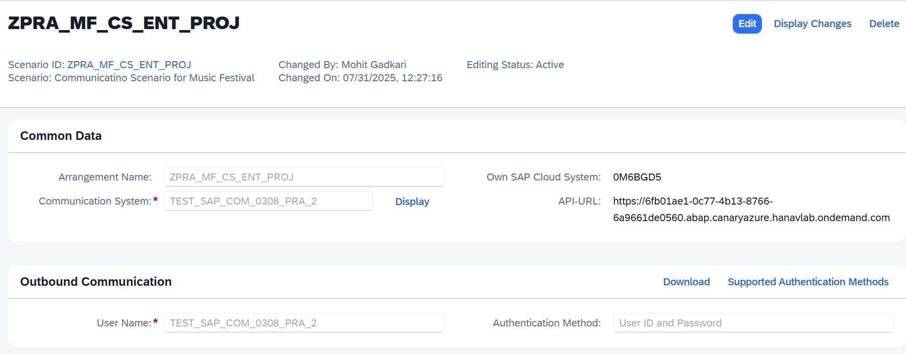

#### Inbound Communication Setup in SAP S/4HANA Cloud Public Edition

1.	##### Create a communication user for inbound communication using the **Maintain Communication Users** application.
    Enter a user name, description, and password. Choose **Save**.

       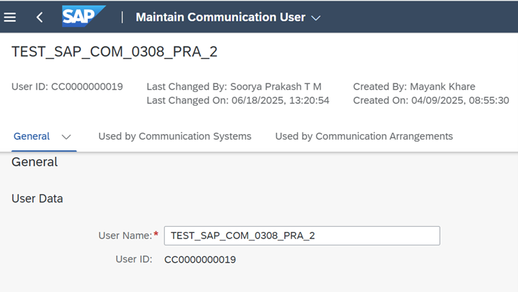

2.	##### Create a communication system using the **Communication Systems** application in the target system.
    1.	Enter a system ID and system Name  of your choice. Choose **Create**.
    2.	Under **Technical Data**, enter a destination system as host name. For example: ***.sap.
       > Note: Don't include https://.
    3.	Add a user for inbound communication. 
        1.	Choose the plus icon.
        2.	As **Authentication Method**, set *User Name and Password*.
        3.	As **User name/Client ID**, set the [communication user](#create-a-communication-user-for-inbound-communication-using-the-maintain-communication-users-application) you've created.
        4.	As **Password**, enter the password of the communication user.
        5.	Choose **Create**.

       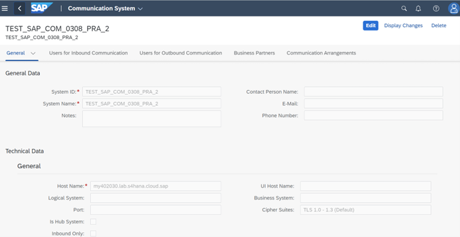
       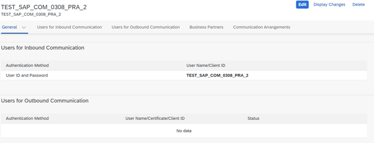       

3.	##### Create a communication arrangement in the target SAP S/4HANA Cloud Public Edition system for the `SAP_COM_0308` communication scenario. 
    1.	Open the **Communication Arrangements** application and choose **New**.
        1.	Enter an **Arrangement Name** of your choice.
        2.	As **Communication System**, set the [communication system](#create-a-communication-system-using-the-communication-systems-application-in-the-target-system) you've created.
        3.	Save your changes.
           
       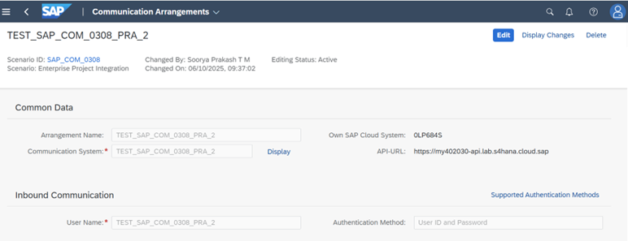   	

#### Enhance the Business Logic to Operate on SAP S/4HANA Cloud Public Edition Data
       
##### Create a Class for Project Creation
   1.	Prepare the client proxy for outbound communication.
        1.	Use the **CL_HTTP_DESTINATION_PROVIDER=>CREATE_BY_COMM_ARRANGEMENT** method with the following parameters to obtain the destination object reference:
            1.	COMM_SCENARIO: Use the [communication scenario created in the outbound setup](#create-a-communication-scenario).
            2.	COMM_SYSTEM_ID: Use the [communication system from the outbound setup](#create-a-communication-system-using-the-communication-systems-application).
            3.	SERVICE_ID: Use the [outbound service](#create-an-outbound-service-with-the-http-service-service-type) you've created.
        2.	Pass the destination object reference obtained above to the **CL_WEB_HTTP_CLIENT_MANAGER=>CREATE_BY_HTTP_DESTINATION** method to instantiate an HTTP client object.
        3.	Use the HTTP client object created in the previous step in the **/IWBEP/CL_CP_FACTORY_REMOTE=>CREATE_V2_REMOTE_PROXY** method along with:
            1.	IS_PROXY_MODEL_KEY = VALUE #( REPOSITORY_ID = 'DEFAULT' PROXY_MODEL_ID = [service consumption model from step 2] PROXY_MODEL_VERSION = '001')
            1.	IO_HTTP_CLIENT: HTTP client object from the previous step.
            2.	IV_RELATIVE_SERVICE_ROOT = '/sap/opu/odata/sap/API_ENTERPRISE_PROJECT_SRV;v=0002/'.
   2.	The structure of an enterprise project can be crafted using the [generated class](#set-up-a-service-consumption-model).
   3.	Populate the enterprise project structure with values, then use the action method to perform the creation process.
   4.	Pass the `A_ENTERPRISE_PROJECT` entity to the `CREATE_RESOURCE_FOR_ENTITY_SET` method using the client proxy reference, and subsequently invoke the `CREATE_REQUEST_FOR_CREATE` method to instantiate the request object.
   5.	Use the `CREATE_DATA_DESCRIPTION_NODE` method on the request object created in the previous step to instantiate the data description node object.
   6.	Pass the enterprise project structure to the `SET_DEEP_BUSINESS_DATA` method on the request object along with the data description node object and execute the request.
   7.	You can have a look at the [reference code](../src/zpra_mf_service/zcl_pra_mf_ent_proj_outb_integ.clas.abap).

#### Enhance the Web App to Display SAP S/4HANA Cloud Public Edition Data

The behavior definition is adjusted to add a button in the web application, while the logic for project creation will be implemented in the behavior implementation class.

1. Make adjustments in the behaviour definition.
    1.	Define and expose a button to create a project in the behavior definition.
    2.	Create a method in the behavior implementation class to call the method to [create a project](#create-a-class-for-project-creation).
    3.	You can have a look at the [reference code](../src/zpra_mf_service/zbp_pra_mf_r_musicfestival.clas.locals_imp.abap).
2. Create a custom entity for fetching the project. Refer to the code [here](../src/zpra_mf_service/zpra_mf_ae_remote_proj.ddls.asddls).
3. There's a class in the custom entity where the code to fetch the project is implemented. Refer to the code [here](../src/zpra_mf_service/zcl_pra_mf_fetch_proj.clas.abap).
4. The custom entity is then associated with the projection view to the fetched project. Refer to the code [here](../src/zpra_mf_service/zpra_mf_c_musicfestivaltp.ddls.asddls).
5. Expose the custom entity in the service definition.
6. The images below show a preview of the application UI.

    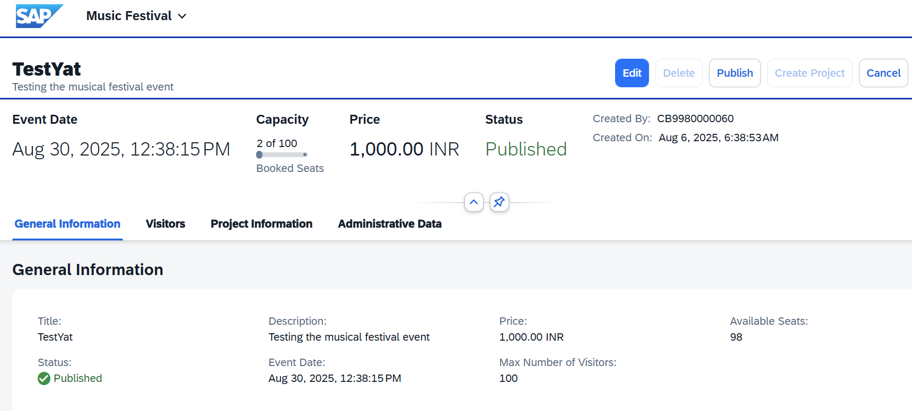
    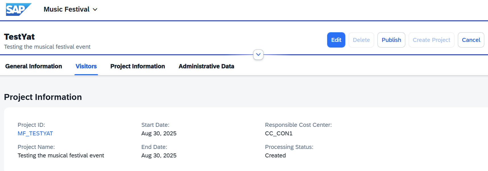
